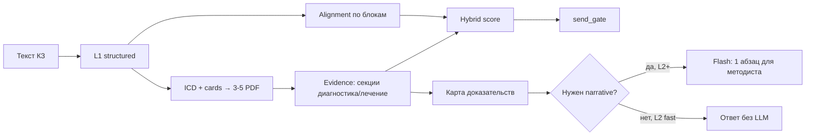

# L2 проверки КЗ: план ускорения и повышения пользы

**Дата:** июнь 2026  
**Проблема:** L2 долго крутится, а для врача/методиста даёт почти то же, что L1.  
**Цель:** L2 за **8-20 с** на Render с **явной добавленной ценностью** поверх L1.

---

## 1. Диагноз (как устроено сейчас)

### 1.1 Два режима L2

| Режим | Где | Время | Что делает |
|-------|-----|-------|------------|
| **L2 lite (Render)** | `CONSULT_RENDER_L2_LITE=1` → `_iter_consult_review_render_l2_lite` | ~20-60 с | L1 structured **без alignment** → 2 PDF × 1 чанк → **1× Gemini synthesize** |
| **L2 full (local)** | `iter_consult_review_pipeline` без lite | 30-120 с | digest Gemini + ICD Gemini + rules + retrieve (+ 2-й pass) + synthesize |

На prod: `CONSULT_RENDER_L2_SKIP_LLM=0`, но lite включён → идёт lite-путь с LLM.

### 1.2 Почему результат «минимальный»

1. **Промпт synthesize уже не просит критерии** - `criteria: []`, итог % из `apply_hybrid_overall_compliance` = в основном **L1 structured** (`consult_overall_score.py`).
2. **Alignment отключён** в lite (`skip_alignment=True`) - нет блок-сверки «КЗ ↔ протокол».
3. **Контекст протокола урезан:** `max_paths=2`, `limit_per_path=1`, `PROTOCOL_CTX_CHARS` default_fast=4000.
4. **Пользователь ждёт Gemini** ради 2-4 предложений `summary_ru`, которые дублируют structured-отчёт.

Итог: **L2 ≈ L1 + задержка + слабые выдержки**.

### 1.3 Почему долго

| Этап | Lite | Full |
|------|------|------|
| Structured L1 | ~2-5 с | - |
| Focus/digest Gemini | - | ~3-8 с |
| ICD refine Gemini | - | ~2-5 с |
| Rules + retrieve | - | ~5-30 с |
| 2-й RAG pass | - | +10-20 с (off на Render) |
| **Synthesize Gemini** | **~8-25 с** | **~8-25 с** |

Узкое место на Render: **один тяжёлый вызов модели** при почти нулевой добавке к L1.

---

## 2. Целевая модель L2 («Evidence Pack»)

**L2 = L1 + сопоставление с протоколом + целевые выдержки + опциональный narrative.**



**Принцип:** детерминированное ядро (быстро, воспроизводимо); LLM только там, где нет правила.

---

## 3. Что должно появиться в ответе L2 (additive JSON)

Поверх текущих полей:

| Поле | Назначение |
|------|------------|
| `l2_mode` | `fast` \| `evidence` \| `narrative` |
| `evidence_pack` | Блоки: diagnosis / exams / treatment / followup → `{protocol_path, section, excerpt, page, match_status}` |
| `alignment` | Всегда в L2 (не skip) |
| `block_gaps` | Список «в КЗ нет / в протоколе требуется» по L2-критериям |
| `protocol_paths_used` | 3-5 PDF с обоснованием (ICD, card, alignment) |
| `review.summary_ru` | Только в `narrative` или кэш; в `fast` - из шаблона structured |

UI: отдельная секция **«Сверка с протоколом»** (не один общий %).

---

## 4. PR-разбивка (5 PR, ~1.5-2 недели)

### PR-1: L2-fast без LLM (MVP, 2-3 дня)

**Branch:** `feat/consult-l2-fast`

- Новый флаг `CONSULT_L2_FAST=1` (default **on** на Render при `CONSULT_RENDER_L2_LITE=1`).
- В `_iter_consult_review_render_l2_lite`: если fast - **пропустить** `_consult_review_synthesize`, собрать `review` из:
  - structured `compliance` + `alignment` (после PR-2) + шаблонный `summary_ru` из top-3 `critical_issues`.
- `apply_hybrid_overall_compliance` без изменений.
- **KPI:** p95 L2 на Render **< 12 с**; тот же `overall_compliance_pct` ±0 vs текущий lite.

**Файлы:** `consult_review_pipeline.py`, `rag_server.py`, `render.yaml`, тест `tests/test_consult_l2_fast.py`.

---

### PR-2: Alignment в L2 lite (2-3 дня)

**Branch:** `feat/consult-l2-alignment`

- Убрать `skip_alignment=True` в lite; лимиты:
  - `CONSULT_L2_ALIGN_MAX_PATHS=3`
  - `CONSULT_L2_ALIGN_MAX_CHUNKS_PER_PATH=8` (через lazy store + caps)
- Использовать `get_rich_chunks_for_consult` + секционный pick (diagnostics/treatment).
- `merge_alignment_into_review` + `sync_structured_with_alignment` как в L1.
- **KPI:** в ответе L2 есть `alignment.cards` ≥ 4 блоков; RAM stable (lazy store).

**Файлы:** `consult_review_pipeline.py`, `consult_alignment.py` (если нужны лимиты), `consult_memory.py`.

---

### PR-3: Evidence Pack - умный отбор чанков (3-4 дня)

**Branch:** `feat/consult-l2-evidence-pack`

- Новый модуль `clinical_knowledge/consult_evidence_pack.py`:
  - Вход: `doc`, `icd_codes`, `match_paths`, lazy chunk store.
  - Выход: `evidence_pack` по блокам КЗ (диагноз, обследование, лечение, наблюдение).
- Источники приоритета:
  1. **Protocol summary cards** (`protocol_summary` / ICD index) - секции без полного RAG.
  2. Rich chunks с `chunk_type` in (`diagnostics`, `treatment`, `protocol_overview`).
  3. `_pick_chunks` с ICD-весами (уже есть в `protocol_practical_lite`).
- Лимиты Render: **5 paths × 3 chunks**, **12k chars** protocol ctx (секционно, не сплошной текст).
- **KPI:** ≥ 6 осмысленных выдержек на типичное КЗ; p95 **< 20 с** с fast (без LLM).

---

### PR-4: Опциональный narrative (L2+) (2 дня)

**Branch:** `feat/consult-l2-narrative-optional`

- `CONSULT_L2_NARRATIVE=0` по умолчанию на Render; `1` - по кнопке «Пояснение методиста» или tier flag.
- Один вызов **Flash** (`gemini-2.0-flash` / lite model): вход только `evidence_pack` + top gaps + **не весь КЗ** (≤ 6k chars).
- Промпт: 1 абзац «что проверить методисту», без дубля %.
- Убрать retry synthesize на fast path.
- **KPI:** narrative **< 8 с**; не блокирует основной L2-fast.

**Файлы:** `rag_server.py` (новый `SYSTEM_CONSULT_L2_NARRATIVE`), `index.html` (кнопка).

---

### PR-5: UI + честные tier + метрики (1-2 дня)

**Branch:** `feat/consult-l2-ui-metrics`

- Подписи tier:
  - **L1** - структура и gate.
  - **L2** - сверка с протоколом + evidence (без LLM).
  - **L2+** - с пояснением модели (опционально).
- Секция UI: таблица evidence, alignment cards, `block_gaps`.
- `/health`: `consult_l2_mode`, средняя `latency_ms` из feedback `kz_analysis` tier=L2.
- Golden replay: `tests/fixtures/consult_replay.jsonl` - latency + наличие `evidence_pack`.

---

## 5. Что НЕ делать в ближайшем цикле

| Идея | Почему отложить |
|------|-----------------|
| Вернуть full L2 retrieve на Render | OOM / 60+ с; заменено evidence + lazy store |
| Снова LLM-критерии с баллами | Дублируют structured; нестабильны |
| 2-й RAG pass в L2 lite | Уже off; мало пользы на allowlist |
| Полный текст КЗ в synthesize | Дорого; заменить evidence_pack |

---

## 6. Env (целевые дефолты Render)

```yaml
CONSULT_RENDER_L2_LITE: "1"
CONSULT_L2_FAST: "1"              # без synthesize по умолчанию
CONSULT_L2_NARRATIVE: "0"         # только по запросу
CONSULT_L2_ALIGN_MAX_PATHS: "3"
CONSULT_L2_EVIDENCE_MAX_PATHS: "5"
CONSULT_L2_EVIDENCE_MAX_CHARS: "12000"
CONSULT_RENDER_L2_SKIP_LLM: "0"   # fast path != skip_llm (устаревший флаг - deprecate)
```

---

## 7. KPI успеха

| Метрика | Сейчас (lite) | Цель |
|---------|---------------|------|
| p95 latency L2 Render | ~30-60 с | **≤ 15 с** (fast), **≤ 25 с** (evidence) |
| Доля L2 с `evidence_pack` ≥ 4 фрагментов | ~0% | **≥ 80%** |
| Доля L2 с `alignment.cards` | 0% (skip) | **≥ 90%** |
| Субъективная польза (методист 1-5) | ~2 | **≥ 4** на пилоте 20 КЗ |
| OOM на L2 | редко | **0** за 50 прогонов |

---

## 8. Порядок merge

```text
PR-1 fast (no LLM) → PR-2 alignment → PR-3 evidence pack → PR-4 narrative opt → PR-5 UI
```

**Быстрый win за 1 PR:** только PR-1 даёт −15-25 с и честный UX («L2 = сверка, не ждите модель»).

---

## 9. Тест-план

| # | Сценарий | Ожидание |
|---|----------|----------|
| T1 | L2 fast, типичное КЗ пульмонология | < 12 с, есть structured + alignment |
| T2 | L2 evidence, дерматология | evidence_pack ≥ 4, treatment section |
| T3 | L2+ narrative по кнопке | + < 10 с, summary_ru не пустой |
| T4 | Сравнение L1 vs L2 | L2 строго superset полей L1 |
| T5 | 10× L2 подряд на Render | RAM стабильна, нет OOM |

Фикстуры: `tests/fixtures/consultations/*.txt`, replay из `consult_replay.jsonl`.

---

## 10. Связанные документы

- [architecture-kravira-fhir-mis-print.html](./architecture-kravira-fhir-mis-print.html) - уровни L0-L2
