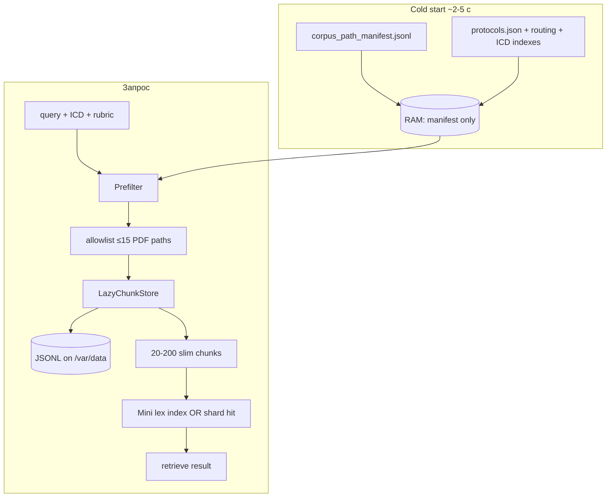

# Lazy Chunk Store: план внедрения (manifest → disk → retrieve)

**Проект:** Protocol  
**Версия:** 1.0  
**Дата:** июнь 2026  
**Цель:** убрать загрузку ~55k чанков в RAM при старте; подгружать только нужные PDF/чанки по предразметке; `retrieve()` работает только на суженном подмножестве.

**Связано:** OOM на Render (consult/search), `docs/deploy/persistent_disk.md`, `scripts/corpus_manifest.py` (coverage-only, расширяем).

---

## 1. Проблема

| Сейчас | Последствие |
|--------|-------------|
| `load_data()` читает все JSONL → `_chunks` + `_chunks_by_path` | 800 MB–1.5 GB RAM на Standard 2 GiB |
| Lex inverted index по всему корпусу | +200–400 MB, долгий cold start |
| `retrieve()` без `path_allowlist` | лексический union по 30k+ индексов → OOM |
| `get_rich_chunks_for_path()` из RAM-dict | alignment/consult тянет сотни чанков на PDF |

**Целевое состояние:** в RAM постоянно **≤50 MB** метаданных; тексты **20–200 чанков** с диска на запрос.

---

## 2. Архитектура



### 2.1 Слои

| Слой | Файл / артефакт | В RAM | На диске |
|------|-----------------|-------|----------|
| **Manifest** | `data/catalog/corpus_path_manifest.jsonl` | path, rubric, icd[], chunk_count, types, shard_id | построчно ~500 KB |
| **Chunk store** | `clinical_knowledge/chunk_store.py` | LRU cache N paths | `corpus_chunks_parts/*.jsonl` |
| **Path lex shard** | `data/catalog/lex_shards/{rubric}.json` или `{path_hash}.json` | lazy load 1 shard | offline build |
| **Retrieve** | `rag_server._retrieve_core` | работает только на `path_allowlist` + loaded chunks | — |

### 2.2 Формат path manifest (одна строка = один PDF)

```json
{
  "path": "minzdrav_protocols/pulmonologiya-ftiziatriya/kp_orvi.pdf",
  "rubric": "pulmonologiya-ftiziatriya",
  "chunk_count": 142,
  "chunk_ids": ["abc123", "..."],
  "icd10_codes": ["J06.9", "J00"],
  "chunk_types": {"diagnostics": 12, "treatment": 8, "body": 90},
  "population": ["adult", "pediatric"],
  "source_part": "chunks.part.03.jsonl",
  "byte_offsets": [[1048576, 1050120], "..."]
}
```

**Минимальный MVP без offsets:** только `path`, `rubric`, `icd10_codes`, `chunk_count`, `source_part` — store делает **один проход по part-файлу** с фильтром `source_path == path` (медленнее, но без миграции JSONL).

**Production:** `byte_offsets` или sidecar `path → chunk_id → file:line` для O(1) seek.

---

## 3. Feature flags (env)

| Flag | Default local | Default Render | Назначение |
|------|---------------|----------------|------------|
| `RAG_STARTUP_MODE` | `full` | `manifest` | `full` = старый load_data; `manifest` = только manifest |
| `RAG_LAZY_CHUNK_STORE` | `0` | `1` | читать чанки с диска по path |
| `RAG_LAZY_RETRIEVE` | `0` | `1` | retrieve только с allowlist + lazy chunks |
| `RAG_FORBID_FULL_CORPUS_RETRIEVE` | `0` | `1` | без allowlist → `[]`, не scan |
| `RAG_CHUNK_CACHE_PATHS` | `32` | `16` | LRU: сколько PDF держать в RAM |
| `RAG_CHUNK_CACHE_MAX_CHUNKS` | `4096` | `2048` | LRU: суммарный cap чанков |
| `RAG_PATH_LEX_SHARDS` | `0` | `1` | lex index по rubric/path shard |
| `RAG_MANIFEST_PATH` | `data/catalog/corpus_path_manifest.jsonl` | `/var/data/corpus_path_manifest.jsonl` | путь к manifest |

Все флаги **аддитивны**: при `RAG_STARTUP_MODE=full` поведение как сегодня.

---

## 4. PR-разбивка (6 PR, merge по порядку)

### PR-1: Path manifest builder (offline, без runtime)

**Branch:** `feat/corpus-path-manifest`  
**Риск:** нулевой (только скрипт + артефакт + тесты)

**Deliverables:**
- `scripts/build_corpus_path_manifest.py` — один проход по JSONL, вывод manifest JSONL
- `clinical_knowledge/corpus_path_manifest.py` — load/query helpers: `paths_by_icd()`, `paths_by_rubric()`, `manifest_stats()`
- `tests/test_corpus_path_manifest.py`
- Дополнить `scripts/corpus_manifest.py` ссылкой на path manifest (coverage vs path index)

**Acceptance:**
- [ ] manifest для полного корпуса: ~478 paths, ~55k chunks
- [ ] `paths_by_icd(["J06.9"])` возвращает ≥1 path за <10 ms (in-memory index)
- [ ] CI: manifest build на `tests/fixtures/chunks.mini.jsonl`

**Не трогаем:** `rag_server.py`, `retrieve()`.

---

### PR-2: LazyChunkStore (disk → slim chunks, LRU)

**Branch:** `feat/lazy-chunk-store`  
**Depends:** PR-1

**Deliverables:**
- `clinical_knowledge/chunk_store.py`:
  - `LazyChunkStore(manifest_path, corpus_dir)`
  - `get_chunks_for_path(path, *, max_chunks=64, chunk_types=None) -> list[dict]`
  - `get_chunks_for_paths(paths, **opts) -> list[dict]`
  - LRU по path + global chunk cap
  - slim fields как в `_load_chunks_from_jsonl` (memory_saver)
- `rag_server.get_rich_chunks_for_path()` → делегирует в store при `RAG_LAZY_CHUNK_STORE=1`
- `tests/test_chunk_store.py` (mini JSONL fixture)

**Acceptance:**
- [ ] При `RAG_LAZY_CHUNK_STORE=1` и `RAG_STARTUP_MODE=full` — store используется, тесты зелёные
- [ ] LRU: 33-й path вытесняет 1-й; RAM не растёт линейно
- [ ] `get_rich_chunks_for_consult()` работает через store без регрессии consult-тестов

---

### PR-3: Startup manifest-only mode

**Branch:** `feat/startup-manifest-mode`  
**Depends:** PR-2

**Deliverables:**
- `rag_server.load_data()` → split:
  - `load_data_full()` — текущая логика
  - `load_data_manifest()` — protocols, routing, manifest index; `_chunks=[]`
- Lifespan: при `RAG_STARTUP_MODE=manifest` вызывать `load_data_manifest()`
- `/health`: `startup_mode`, `manifest_paths`, `chunk_cache_stats`, `rag_ready=true` сразу после manifest
- `render.yaml`: `RAG_STARTUP_MODE=manifest`, `RAG_LAZY_CHUNK_STORE=1`

**Acceptance:**
- [ ] Render cold start: порт открыт <5 с, `rag_ready=true`, `chunks=0` в health
- [ ] Поиск с allowlist (МКБ) работает через lazy store
- [ ] Rollback: `RAG_STARTUP_MODE=full` — старое поведение

---

### PR-4: Retrieve on allowlist + lazy chunks

**Branch:** `feat/lazy-retrieve`  
**Depends:** PR-3

**Deliverables:**
- `_retrieve_core()`:
  - если `RAG_LAZY_RETRIEVE=1` и есть `path_allowlist` → chunks = `store.get_chunks_for_paths(allowlist)`; lex только по их global indices
  - если `RAG_FORBID_FULL_CORPUS_RETRIEVE=1` и нет allowlist → `[]` (+ optional HTTP 400 на API layer)
- Удалить/загейтить consult fallback `path_allowlist=None` (уже частично в r231)
- `build_protocol_search_context()` → всегда возвращает `path_allowlist` на Render (ICD index → paths)
- `tests/test_lazy_retrieve.py`, обновить `tests/test_retrieve_memory.py`

**Acceptance:**
- [ ] Симптом без МКБ на Render: не OOM; пустой retrieve или redirect в ICD funnel
- [ ] МКБ J06.9: retrieve <3 с, ≤15 PDF, ≤64 chunks
- [ ] Consult L1/L2 lite: без `_chunks` в RAM

---

### PR-5: Path lex shards (optional speedup)

**Branch:** `feat/path-lex-shards`  
**Depends:** PR-4  
**Можно отложить** если PR-4 достаточно быстр на allowlist ≤15 PDF

**Deliverables:**
- `scripts/build_path_lex_shards.py` — inverted index token→chunk_id per rubric
- `clinical_knowledge/path_lex_index.py` — load shard, query без full corpus
- Embed rerank: только по prefiltered chunk_ids (уже есть precomputed embed)

**Acceptance:**
- [ ] retrieve по allowlist без построения full `_lex_inverted_index`
- [ ] Benchmark: `scripts/benchmark_search_speed.py` — не хуже PR-4

---

### PR-6: Deploy, docs, deprecation

**Branch:** `feat/lazy-chunk-store-deploy`  
**Depends:** PR-4 (или PR-5)

**Deliverables:**
- `docs/deploy/lazy_chunk_store.md` — заливка manifest на Persistent Disk
- CI step (optional): build manifest on fixture
- Deprecation note: `RAG_STARTUP_MODE=full` → local dev only
- Dashboard `/health`: `chunk_store`, `manifest_version`

**Render checklist:**
1. `python3 scripts/build_corpus_path_manifest.py --corpus /var/data/corpus_chunks_parts --output /var/data/corpus_path_manifest.jsonl`
2. Env: `RAG_STARTUP_MODE=manifest`, `RAG_LAZY_CHUNK_STORE=1`, `RAG_LAZY_RETRIEVE=1`, `RAG_FORBID_FULL_CORPUS_RETRIEVE=1`
3. Verify: `curl /health | jq '{startup_mode, manifest_paths, chunks, rag_ready}'`

---

## 5. Миграция retrieve (детально)

### 5.1 Текущий поток

```
query → tokenize → lex inverted (all chunks) → union candidates → score → top-K
```

### 5.2 Целевой поток

```
query + ICD + rubric
  → resolve allowlist (ICD index | cards | manifest.paths_by_icd)
  → if empty and FORBID_FULL: return []
  → store.get_chunks_for_paths(allowlist)
  → build ephemeral mini_lex OR path_lex_shard.query
  → score + optional embed rerank (precomputed vectors by chunk_id)
  → top-K slim rows
```

### 5.3 Точки интegrации в коде

| Место | Изменение |
|-------|-----------|
| `clinical_knowledge/search_retrieval.build_protocol_search_context` | allowlist из manifest, не из full retrieve |
| `consult_review_pipeline` | retrieve только если allowlist; уже частично |
| `rag_server._api_assist_impl` | `build_search_path_allowlist` + lazy retrieve |
| `get_rich_chunks_for_path` | → ChunkStore |
| `load_data` / lifespan | manifest mode |

---

## 6. Тест-план (сквозной)

| # | Сценарий | Ожидание |
|---|----------|----------|
| T1 | Cold start manifest mode | `/health` <5 s, `chunks=0` |
| T2 | Assist J06.9 | protocols ≥1, no OOM |
| T3 | Assist «кашель» без МКБ | funnel/ICD step или S1 allowlist; no full scan |
| T4 | Consult L1 upload | alignment cards, RAM stable |
| T5 | Consult L2 lite | synthesize OK |
| T6 | 10 sequential searches | no memory growth (LRU) |
| T7 | `RAG_STARTUP_MODE=full` regression | full pytest green |

**Benchmark:** `python3 scripts/benchmark_search_speed.py --base $URL` до/после PR-4.

---

## 7. Риски и откат

| Риск | Mitigation |
|------|------------|
| Медленный read JSONL без offsets | PR-1 offsets; interim: index by `source_part` + filter |
| Regress Hit@k без full corpus | allowlist из ICD + symptom routing; golden eval в CI |
| Два режима (full/manifest) | флаги; local full, Render manifest |
| Stale manifest после rebuild corpus | sha256 в manifest header; `/health.manifest_sha256` |

**Откат на Render:** `RAG_STARTUP_MODE=full`, `RAG_LAZY_CHUNK_STORE=0`, redeploy (как сейчас, с OOM caps).

---

## 8. Оценка трудозатрат

| PR | Объём | Календарь |
|----|-------|-----------|
| PR-1 manifest builder | ~300 LOC + tests | 1–2 дня |
| PR-2 chunk store | ~400 LOC + tests | 2–3 дня |
| PR-3 startup mode | ~150 LOC + render | 1 день |
| PR-4 lazy retrieve | ~250 LOC + tests | 2–3 дня |
| PR-5 lex shards | ~350 LOC (optional) | 2–4 дня |
| PR-6 deploy/docs | docs + yaml | 0.5 дня |

**MVP (PR-1…4):** ~1–1.5 недели. **С shards (PR-5):** +3–5 дней.

---

## 9. KPI успеха

| Метрика | Сейчас (Render) | Цель |
|---------|-----------------|------|
| RAM idle после старта | ~1.2–1.8 GiB | <400 MiB |
| Cold start до `/health` | 1–3 мин | <10 с |
| OOM на consult/search | периодически | 0 за 20 прогонов |
| Assist МКБ p95 | ~0.4–5 с | ≤5 с |
| Assist симптом p95 | ~15 с / OOM | ≤8 с (после ICD step) |

---

## 10. Порядок merge

```text
PR-1 manifest → PR-2 store → PR-3 startup → PR-4 retrieve → [PR-5 shards] → PR-6 deploy
```

Каждый PR: `ruff check`, `pytest -q`, bump `BUILD_VERSION`, `git push origin`.

---

## 11. Связанные документы

- [persistent_disk.md](./deploy/persistent_disk.md)
- [search-navigation-improvement-plan-v2.md](./search-navigation-improvement-plan-v2.md)
- [implementation_plan.md](./implementation_plan.md) — принцип feature flags + аддитивность
