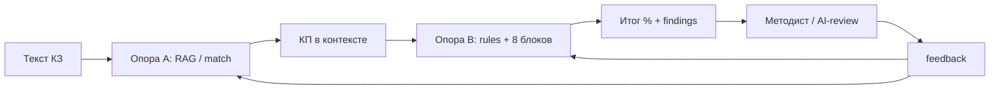
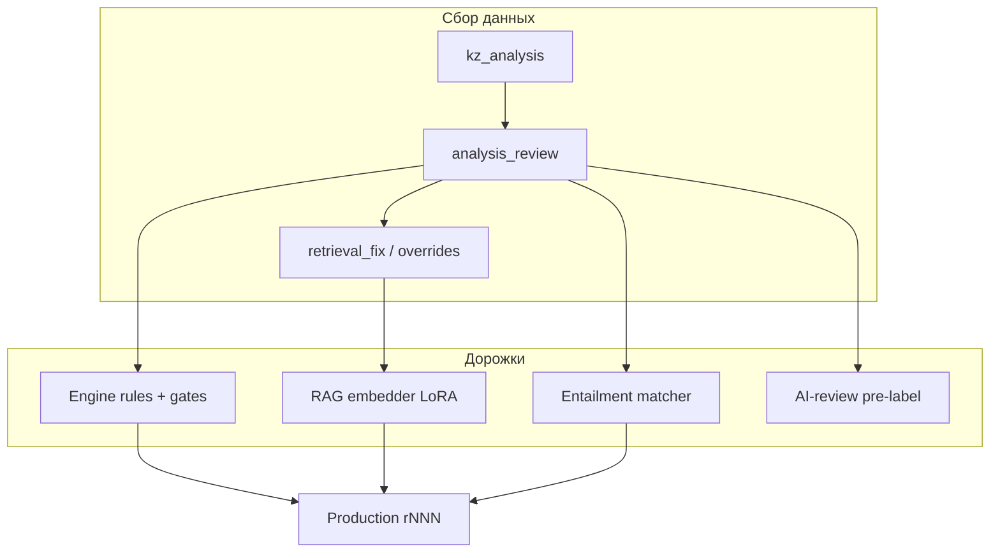
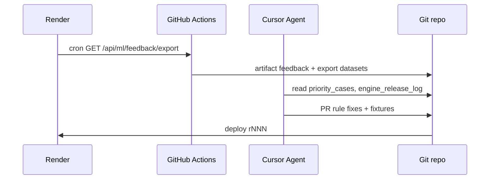

# Приоритетный план: кабинет методиста → данные → обучение → улучшение анализа КЗ

**Проект:** Protocol  
**Версия:** 1.1  
**Дата:** июнь 2026  
**Связанные документы:** [methodist-workbench-tz.md](./methodist-workbench-tz.md), [ml/README.md](../ml/README.md)

---

## 0. North Star: две опоры качества КЗ

Конечная цель — не «накопить N events в JSONL», а **максимально точный end-to-end анализ КЗ**:

| Опора | Вопрос системы | Компоненты | Главная метрика |
|-------|----------------|------------|-----------------|
| **A. Подбор протокола** | Какой КП Минздрава применим к этому КЗ? | RAG, embedder, rubric/ICD routing, `protocol_match` | **Protocol hit@3** на размеченных `retrieval_fix` + методист «верный КП» |
| **B. Соответствие протоколу** | Насколько КЗ выполняет требования выбранного КП? | `rule_checker`, 8 блоков, medication safety, gates | **consult_gold pass rate** + средний rating методиста ≥ 3.5 |



**Правило v1.1:** пока в `kz_analysis` часто **пустой** `matched_protocol_paths` / `retrieval_top_paths` — приоритет **A не ниже B**. LoRA embedder без меток `retrieval_fix` не даст end-to-end эффекта (урок embedder exp_001).

### 0.1 Что план уже дал (июнь 2026)

| Сделано | Эффект |
|---------|--------|
| Кабинет методиста + AI-review | Сбор меток без Label Studio |
| r109–r111 engine fixes | Реальный прирост качества B (neoplasm, NSAID, context gates) |
| Export + pull + дашборд r112 | Видимость прогресса, readiness ~32%, triage для агента |
| `engine_release_log.json` | Доказуемый «до/после» на re-analyze |

### 0.2 Что план ещё не дал (блокеры цели)

| Пробел | Почему мешает цели |
|--------|-------------------|
| Только **1** `retrieval_fix` | Опора A почти не обучается |
| **5× diagnosis_formula** на один КЗ (pl_1_f) | Шум → методист не доверяет B |
| Нет **очереди** в UI | Active learning не масштабируется |
| Нет **batch** + nightly sync | Медленный цикл «fix → verify» |
| ML deploy отложен | OK — engine даёт больший ROI при <60% readiness |

---

## Содержание

1. [Контекст и цели](#1-контекст-и-цели)
2. [Текущее состояние (baseline)](#2-текущее-состояние-baseline)
3. [Приоритетный план по фазам](#3-приоритетный-план-по-фазам)
4. [Дорожки улучшения](#4-дорожки-улучшения)
5. [Batch-разбор КЗ](#5-batch-разбор-кз)
6. [Автоматизация Cursor ↔ Render](#6-автоматизация-cursor--render)
7. [Критерии готовности к ML](#7-критерии-готовности-к-ml)
8. [Метрики успеха пилота](#8-метрики-успеха-пилота)
9. [Риски и ограничения](#9-риски-и-ограничения)

---

## 1. Контекст и цели

### 1.1 Проблема

- Поток ~25 000 КЗ/мес; ручной аудит 2–5%.
- Детерминированное ядро (правила 482+, compliance, send_gate) работает в production, но **ошибки на реальных КЗ** выявляются только при разметке методистом.
- ML-каркас (`ml/`, `export_training_feedback.py`) собирает события, но **fine-tune и деплой моделей** ещё не замкнуты на production.
- Embedder exp_001 улучшил офлайн-MRR, но **end-to-end анализ КЗ** на эталоне не изменился без меток на реальных ошибках.

### 1.2 Цели плана

| ID | Цель | Горизонт |
|----|------|----------|
| G1 | ≥50 размеченных уникальных КЗ в feedback | 1-й месяц пилота |
| G2 | 100% прогонов в режиме методиста → `kz_analysis` | уже реализовано |
| G3 | Active learning: ≥20 кейсов/нед из очереди | фаза B |
| G4 | ≥10 кандидатов в `consult_gold` за квартал | фаза C |
| G5 | Первый deploy LoRA embedder после ≥50 `retrieval_fix` | Q4 2026 |
| G6 | Снижение priority_cases (rating≤2) на 30% после engine fixes | ongoing |

---

## 2. Текущее состояние (baseline)

| Компонент | Статус | Примечание |
|-----------|--------|------------|
| UI `?mode=methodist` | ✅ MVP | Этап 1 + AI-review + ручная форма |
| `POST /api/ml/feedback` | ✅ | Append-only JSONL |
| `GET /api/ml/feedback/export` | ✅ r108 | Sync с Render |
| `GET /api/methodist/stats` | ✅ r112 | Дашборд ML |
| Вкладка «Очередь» | ❌ | ТЗ фаза B |
| `run_methodist_batch.py` | ❌ | Только smoke на 2 кейса |
| `ml/train/*` deploy | ❌ | `--dry-run`, offline exp |
| Engine fixes из feedback | ✅ r109–r111 | neoplasm, NSAID, context gates |

**Baseline пилота (июнь 2026):** ~39 событий feedback, ~10 уникальных КЗ, 13 analysis_review, 9 priority_cases.

---

## 3. Приоритетный план по фазам

### P0 — Инфраструктура данных (1–2 недели)

| # | Задача | Результат | Effort | Impact | Статус |
|---|--------|-----------|--------|--------|--------|
| P0.1 | **`GET /api/methodist/stats`** | JSON + UI дашборд | 2 д | Видимость | ✅ r112 |
| P0.2 | **`scripts/run_methodist_batch.py`** | Папка PDF → L1 × N, optional AI | 2 д | Масштаб T1 | ⬜ |
| P0.3 | **GitHub Action nightly sync** | pull → export → artifact | 0.5 д | Cursor + CI | ⬜ |
| P0.4 | **`GET /api/methodist/analysis/{id}`** | Снимок api_result | 1 д | Triage | ⬜ |
| P0.5 | **Protocol hit@k в stats** | Метрика опоры A в дашборде | 1 д | Фокус на RAG | ⬜ |

**Критерий приёмки P0:** batch 20+ КЗ за прогон; дашборд показывает readiness + protocol match rate; агент получает feedback без ручного curl.

---

### P1 — Очередь, шум правил, retrieval (2–3 недели)

**Трек B (compliance):**

| # | Задача | Результат | Effort | Impact |
|---|--------|-----------|--------|--------|
| P1.3 | **Dedup diagnosis_formula** | 5 FP → 1 finding | 1 д | Доверие к B |
| P1.4 | **Venous/thrombosis gate I80.x** | pl_1_f без cardiology FP | 1 д | Пилот флеболог |
| P1.6 | **Rule family gates** | Шаблон gate по ICD+specialty для top-3 override rule_id | 3 д | Системный fix B |
| P1.7 | **Sparse KZ caps** | Документация/осмотр влияют на treat/safe (report_n_2) | 2 д | Честный % |

**Трек A (protocol match):**

| # | Задача | Результат | Effort | Impact |
|---|--------|-----------|--------|--------|
| P1.8 | **UI: «Правильный протокол» обязательнее** | При tag `wrong_protocol` / `missed_protocol` — форма retrieval_fix | 1 д | Метки для LoRA |
| P1.9 | **Rubric+ICD pre-filter** | Сузить RAG до рубрики до embed search | 2 д | Меньше miss |
| P1.10 | **Golden protocol pairs** | 20 пар diagnosis→path из размеченных кейсов | 2 д | Eval опоры A |

**UX / active learning:**

| # | Задача | Результат | Effort | Impact |
|---|--------|-----------|--------|--------|
| P1.1 | **`GET /api/methodist/queue`** | pending + priority + sample | 2 д | G3 |
| P1.2 | **UI вкладка «Очередь»** | Клик → прогон в «Проверить КЗ» | 3 д | 20 кейсов/нед |
| P1.5 | **`analyze_priority_cases.py`** | MD-отчёт для агента | 1 д | Auto-triage |

**Критерий приёмки P1:** priority_cases ↓; ≥5 `retrieval_fix` за месяц; средний rating ↑; очередь без JSONL вручную.

---

### P2 — Замыкание ML-цикла (1–2 месяца)

| # | Задача | Результат | Effort | Impact |
|---|--------|-----------|--------|--------|
| P2.1 | **`consult_gold_candidate` + promote** | Кнопка «В gold» → `promote_gold_candidate.py` | 2 д | G4 эталоны |
| P2.2 | **Реальный `finetune_embedder.py`** | LoRA на `retrieval_pairs_resolved.jsonl` | 1 нед | После ≥50 retrieval_fix |
| P2.3 | **`run_ab_embedder_kz.py` в CI** | Регрессия vs consult_gold перед deploy | 2 д | Безопасный deploy |
| P2.4 | **`model_manifest.json` active** | Sidecar embedder в production | 3 д | RAG improvement |
| P2.5 | **Entailment fine-tune** | `finetune_entailment.py` на overrides | 1 нед | Меньше FP по терминам |

**Критерий приёмки P2:** deploy embedder только если consult_gold pass rate ≥ baseline и golden RAG не хуже.

---

### P3 — Масштаб пилота (квартал)

| # | Задача | Результат |
|---|--------|-----------|
| P3.1 | Batch API на Render | POST `/api/methodist/batch` для папки из МИС |
| P3.2 | Shadow A/B в UI | Две колонки retrieval для сравнения |
| P3.3 | Dedup priority_cases по text_hash | Только latest review в очереди |
| P3.4 | Интеграция МИС (Айболит) | consultation_id из внешней системы |

---

## 4. Дорожки улучшения



### 4.1 Дорожка A — Engine (80% усилий сейчас)

**Вход:** `analysis_review` rating≤2, tags `false_positive_rule`, `overrides[]`.

**Цикл:**
1. `pull_methodist_feedback.sh` → `export_training_feedback.py`
2. `priority_cases.jsonl` → группировка по rule_id / rubric
3. Правка `rule_checker.py`, `compliance_engine.py`, gates
4. Regression fixtures + re-analyze на Render
5. Запись в `data/ml/engine_release_log.json`

**Примеры уже сделанных fixes (r109–r110):**

| Кейс | До | После | Fix |
|------|-----|-------|-----|
| report_n_2 | overall 85.9%, neoplasm rule | 61.8%, caps sparse | neoplasm gate + neuro caps |
| dual NSAID | treat/safe 100% | treat 25%, safe 0% | concurrent NSAID detection |
| obgyn 61y | pregnancy rule FP | gate по возрасту | pregnancy context gate |

---

### 4.2 Дорожка B — RAG embedder (15%)

**Вход:** `retrieval_fix` (query, rejected_path, chosen_path).

**Порог старта:** ≥50 пар из **реального feedback** (не bootstrap из structured_index).

**Сейчас:** 1 retrieval_fix, 300 bootstrap pairs — **недостаточно для production fine-tune**.

**Pipeline:**
```bash
ML_FEEDBACK_DIR=data/ml/feedback_render python3 scripts/export_training_feedback.py
python3 ml/train/finetune_embedder.py --dataset ml/datasets/retrieval_pairs_resolved.jsonl
python3 scripts/run_ab_embedder_kz.py
```

---

### 4.3 Дорожка C — Entailment (5%)

**Вход:** `methodist_override`, `overrides` в analysis_review → `entailment_pairs.jsonl`.

**Порог:** ≥100 пар.

**Сейчас:** ~29 пар — ранняя стадия, продолжать сбор.

---

### 4.4 Дорожка D — AI-review как pre-label

Этап 2 Gemini генерирует `engine_improvements_ru`, overrides. При `methodist_approved: true` — сильная метка для backlog и будущего critic-model.

**Не заменяет** human gold для обучения compliance-скoring.

---

## 5. Batch-разбор КЗ

### 5.1 Зачем

Ручной UI на 25k КЗ/мес не масштабируется. Batch L1 + фильтр «на разметку только спорные» — целевая модель.

### 5.2 Трёхуровневая стратегия

| Tier | Действие | Кто размечает |
|------|----------|---------------|
| T1 | L1 все загруженные КЗ → `kz_analysis` | Автомат |
| T2 | AI-review если rules=0%, safety cap, hybrid mismatch | AI + методист approve |
| T3 | Очередь priority + random 5% | Методист |

### 5.3 CLI (целевой)

```bash
python3 scripts/run_methodist_batch.py \
  --folder clients_consult/ \
  --tier L1 \
  --workers 4 \
  --ai-review auto \
  --out ml/experiments/batch_2026-06-01/
```

### 5.4 Существующие инструменты

| Инструмент | Feedback | AI-review |
|------------|----------|-----------|
| `analyze_consultation.py --folder` | ❌ | ❌ |
| `run_methodist_ai_smoke.py` | локально | ✅ 2 кейса |

---

## 6. Автоматизация Cursor ↔ Render

### 6.1 Текущий ручной цикл

```bash
export METHODIST_TOKEN='…'
./scripts/pull_methodist_feedback.sh https://protocol-bimy.onrender.com
ML_FEEDBACK_DIR=data/ml/feedback_render python3 scripts/export_training_feedback.py
```

### 6.2 Целевой автоматический цикл



### 6.3 GitHub Action (шаблон)

Файл: `.github/workflows/methodist-feedback-sync.yml`

- Schedule: `0 6 * * *`
- Secrets: `METHODIST_TOKEN`, `RENDER_URL`
- Steps: pull → export → `analyze_priority_cases.py` → upload artifact
- Опционально: commit `ml/datasets/export_manifest.json`

### 6.4 API для агента

| Endpoint | Назначение |
|----------|------------|
| `GET /api/methodist/stats` | Дашборд-метрики JSON |
| `GET /api/ml/feedback/export?since=` | tar.gz events |
| `GET /api/methodist/analysis/{id}` | Снимок прогона (P0.4) |
| `GET /api/ml/feedback/events` | Постраничный JSON (будущее) |

---

## 7. Критерии готовности к ML

Пороги отображаются в дашборде методиста (`GET /api/methodist/stats`):

| Метрика | Target | Назначение |
|---------|--------|------------|
| Уникальных КЗ (`kz_analysis`) | 50 | Объём пилота G1 |
| `analysis_review` | 30 | Мета-оценки системы |
| `retrieval_fix` (feedback) | 50 | Fine-tune embedder |
| `entailment_pairs` | 100 | Fine-tune matcher |
| Reviews на рубрику | 8 | Покрытие специальностей |
| AI-approved reviews | 20 | Pre-label quality |

**Правило:** пока `readiness_overall_pct` < 60% — приоритет **engine fixes**, не ML deploy.

---

## 8. Метрики успеха пилота (v1.1 — две опоры)

### Опора A — подбор протокола

| Метрика | Baseline | Цель 3 мес |
|---------|----------|------------|
| `retrieval_fix` из feedback | 1 | ≥20 |
| Protocol hit@3 (на golden pairs) | не замеряется | ≥70% |
| КЗ с непустым `matched_protocol_paths` | низкий % | ≥80% прогонов L1 |
| Tag `missed_protocol` / `wrong_protocol` в reviews | есть | −50% |

### Опора B — соответствие протоколу

| Метрика | Baseline | Цель 3 мес |
|---------|----------|------------|
| Уникальных размеченных КЗ | ~10 | ≥50 |
| Средний rating методиста | ~2.5 | ≥3.5 |
| priority_cases (rating≤2) | 9 | ≤5 |
| Top-3 rule_id FP (neoplasm, pregnancy, diagnosis_formula) | частые | −50% срабатываний |
| consult_gold строк | 9 | ≥19 |
| consult_gold pass rate (regression) | baseline | не ниже baseline |

### Сводная

| readiness_overall_pct | Действие |
|----------------------|----------|
| < 40% | Только engine + сбор меток, batch T1 |
| 40–60% | + очередь, retrieval_fix, rule family gates |
| > 60% | + LoRA embedder A/B, entailment pilot |

---

## 9. Риски и ограничения

| Риск | Митигация |
|------|-----------|
| Мало retrieval_fix для ML | Фокус на engine; bootstrap не смешивать с feedback в eval |
| Duplicate reviews на один text_hash | Dedup в очереди (P3.3) |
| Render disk без persistent volume | ML_FEEDBACK_DIR fallback; export sync |
| AI-review JSON incomplete | r111 gold fallback; retry |
| ПДн в feedback | Только hash; текст в secure store on-prem |

---

## Приложение A: порядок работ (актуальный спринт)

**Неделя 1 — закрыть P0 + быстрые wins B**

1. ✅ Дашборд ML (r112)
2. ✅ `run_methodist_batch.py` — batch L1 (fixtures 16/16)
3. ✅ GitHub Action `methodist-feedback-sync.yml`
4. ✅ Venous I80.x gate + tests `test_venous_rule_gates.py`
5. ✅ Dedup diagnosis_formula (engine + UI)
6. ✅ `GET /api/methodist/queue` + таблица в дашборде
7. ✅ `analyze_priority_cases.py`
8. ⬜ Re-analyze obgyn + pull → verify в дашборде

**Неделя 2 — очередь + опора A**

6. ⬜ `GET /api/methodist/queue` + UI вкладка
7. ⬜ Усилить форму retrieval_fix при tags wrong/missed protocol
8. ⬜ Re-analyze obgyn + pull → verify в дашборде
9. ⬜ `analyze_priority_cases.py` → weekly triage для Cursor

**Неделя 3–4 — системные gates**

10. ⬜ Rule family gates для top override rule_id
11. ⬜ consult_gold_candidate + 3 новых эталона из priority
12. ⬜ Protocol hit@k в дашборде и export manifest

---

## Приложение C: готовность агента к выполнению

| Вопрос | Ответ |
|--------|-------|
| Готов выполнять план? | **Да** — инфраструктура feedback и дашборд есть; следующий шаг P0.2–P0.4 + P1.3–P1.4 |
| Что нужно от методиста | 5–10 КЗ/нед с «Правильный протокол» при ошибке RAG; approve AI-review |
| Что нужно от DevOps | Render persistent disk для feedback; secrets в GitHub Actions |
| Риск «ML ради ML» | Отложен до readiness >60% и ≥20 retrieval_fix |

**Еженедельный ритуал (30 мин):** pull feedback → export → priority report → 1–2 engine PR → re-analyze на Render → проверка дашборда Δ.

---

## Приложение B: ссылки

- Экспорт: `scripts/export_training_feedback.py`
- Pull: `scripts/pull_methodist_feedback.sh`
- Smoke: `scripts/run_methodist_ai_smoke.py`
- Release log: `data/ml/engine_release_log.json`
- Datasets: `ml/datasets/`
