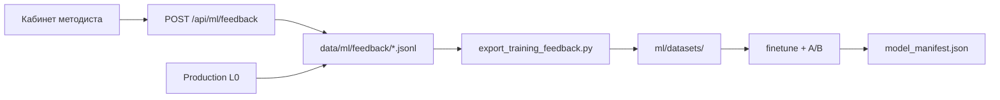

# ТЗ: Кабинет методиста (Methodist Workbench)

**Проект:** Protocol  
**Версия ТЗ:** 1.0  
**Дата:** июнь 2026  
**Заказчик:** ОДО «МЦ «Кравира»» (пилот)  
**Цель:** режим для методслужбы - тестирование оценки КЗ, разметка результатов, накопление данных для обучения ML и расширения gold-наборов без изменения клинического UX врача.

---

## 1. Контекст и границы

### 1.1 Проблема

- Поток ~25 000 КЗ/мес; ручной аудит 2-5%.
- ML-каркас (`ml/`, `export_training_feedback.py`) есть, но **нет UI и API** для сбора меток методиста.
- A/B показал: embedder улучшает офлайн-MRR, но **end-to-end анализ КЗ** на эталоне не изменился - нужны метки на реальных ошибках, не на всём потоке.

### 1.2 Цели

| # | Цель | Измеримость |
|---|------|-------------|
| G1 | Методист проверяет КЗ и ставит оценку в том же продукте | ≥50 размеченных кейсов за 1-й месяц пилота |
| G2 | Автосохранение контекста анализа для ML | 100% прогонов в режиме методиста пишут `kz_analysis` |
| G3 | Очередь «сомнительных» кейсов (active learning) | Методист разбирает ≥20 кейсов/нед из очереди |
| G4 | Расширение эталонов | ≥10 кандидатов в `consult_gold` за квартал |
| G5 | Не ломать UX врача/B2C | Режим методиста скрыт без авторизации |

### 1.3 Вне scope (v1)

- Интеграция с МИС «Айболит» (отдельный этап).
- Label Studio / внешняя разметка.
- Обучение и деплой моделей из UI (только CLI, как сейчас).
- Мульти-организационный SaaS (только Кравира / один tenant).
- Изменение логики `send_gate` через ML.

---

## 2. Роли и доступ

| Роль | Доступ | Описание |
|------|--------|----------|
| **Врач / B2C** | Обычный UI | Без панели разметки |
| **Методист** | `?mode=methodist` + токен | Проверка, оценка, очередь |
| **Админ ML** | методист + дашборд | Экспорт, статистика меток |
| **Система** | server-side | Автолог, append-only feedback |

### 2.1 Авторизация (v1)

- Env: `METHODIST_TOKEN` (shared secret) или `METHODIST_PIN` (6 цифр).
- Передача: заголовок `X-Methodist-Token` или query `?methodist_token=…` при первом входе → `sessionStorage`.
- Без токена: UI методиста не рендерится, API возвращает `403`.
- Аудит: в каждом событии поле `reviewer` (логин/инициалы методиста, ввод при входе).

### 2.2 Авторизация (v2, опционально)

- LDAP / учётная запись клиники, RBAC в БД.

---

## 3. Режимы работы UI

### 3.1 Точки входа

- URL: `/` с `?mode=methodist` или отдельный путь `/methodist` (редирект на тот же `index.html` с флагом).
- В шапке бейдж: **«Режим методиста»** (цвет отличный от B2C).

### 3.2 Вкладки кабинета

| Вкладка | Назначение |
|---------|------------|
| **Проверить КЗ** | Загрузка PDF/текста, выбор tier L0/L1/L2, прогон |
| **Очередь** | Список кейсов на разбор (warnings, random sample, низкая оценка) |
| **История** | Последние N размеченных/неразмеченных прогонов |
| **Статистика** | Счётчики меток, pass rate, топ rule_id с overrides |

---

## 4. Функциональные требования

### 4.1 FR-01. Прогон анализа (как сейчас + расширение)

**Описание:** методист загружает КЗ или вставляет текст, выбирает уровень, получает результат.

| Параметр | Значение |
|----------|----------|
| API L0 | `POST /api/consult-compliance-screen` |
| API L1/L2 | `POST /api/consult-review/tier` (`tier`: L0/L1/L2) |
| API полный | `POST /api/consult-review` (как B2C) |

**Дополнительно для методиста (ответ + UI):**

- `analysis_id` - UUID прогона (генерирует сервер).
- `text_hash` - SHA-256 нормализованного текста.
- `model_info` - версия embedder / флаги RAG.
- Раскрываемые блоки: `retrieval_paths`, `clinical_rules.findings`, `send_gate`, CISZ.

**После успешного прогона:** автоматическая запись `kz_analysis` (см. §6.1).

---

### 4.2 FR-02. Панель оценки результата

Отображается **под** блоком `renderConsultSendGate` / structured analysis, только в `mode=methodist`.

#### 4.2.1 Общая оценка

| Элемент | Тип | Обязательность |
|---------|-----|----------------|
| Оценка качества анализа | 1-5 звёзд или 👍/👎/😐 | Обязательно для «Сохранить» |
| Вердикт | select: `correct` / `mostly_correct` / `partially_wrong` / `wrong` | Обязательно |
| Теги проблем | multi-checkbox | Опционально |

**Теги (фиксированный список v1):**

- `wrong_protocol` - неверный КП в RAG
- `missed_protocol` - не нашли нужный КП
- `false_positive_rule` - ложное замечание правила
- `missed_issue` - пропущена реальная ошибка в КЗ
- `wrong_population` - ошибка популяции (дети/взрослые)
- `cisz_wrong` - неверно по ЦИСЗ
- `score_misleading` - итоговый % вводит в заблуждение
- `other` - прочее (+ поле комментария)

#### 4.2.2 Разметка по findings (правила)

Для каждого finding из `structured_analysis.compliance` / `clinical_rules`:

| Поле | Тип |
|------|-----|
| `rule_id` | read-only |
| Системный verdict | pass/fail read-only |
| Вердикт методиста | toggle pass / fail / «не применимо» |
| Комментарий | text, ≤280 символов |

При расхождении → событие `methodist_override`.

#### 4.2.3 Разметка RAG (протоколы)

| Поле | Тип |
|------|-----|
| Список топ-5 `retrieval_paths` | read-only + ссылки на PDF |
| «Правильный протокол» | autocomplete по корпусу (`/api/assist` или новый search) |
| «Система ошибочно выбрала» | select из топ-5 |

При заполнении → `retrieval_fix`.

#### 4.2.4 Кнопки действий

| Кнопка | Действие |
|--------|----------|
| **Сохранить оценку** | `POST /api/ml/feedback` → `analysis_review` |
| **Добавить в gold** | `consult_gold_candidate` (только при 👎 или вердикт ≤ partially_wrong) |
| **Пропустить** | без feedback, кейс остаётся в очереди |
| **Следующий из очереди** | загрузить следующий `analysis_id` |

---

### 4.3 FR-03. Очередь на разбор (active learning)

**Источники кейсов в очередь (приоритет сверху вниз):**

1. `send_decision` ∈ `blocked`, `blocked_soft`, `needs_review` (из production L0, когда появится автолог).
2. Ручные загрузки методиста без оценки >24 ч.
3. Случайная выборка 2% из автолога за неделю (если поток подключён).
4. Кейсы с `rating` ≤2 из прошлых оценок - на повторную проверку (adjudication).

**API:** `GET /api/methodist/queue?limit=20&offset=0`

**Ответ:**

```json
{
  "items": [
    {
      "analysis_id": "uuid",
      "ts": "2026-06-12T10:00:00Z",
      "tier": "L0",
      "send_decision": "allowed_with_warnings",
      "gate_score": 68,
      "rubric": "gastroenterologiya",
      "text_hash": "sha256:…",
      "has_review": false,
      "priority": 1
    }
  ],
  "total": 42
}
```

**UI:** таблица с фильтрами (tier, рубрика, «только без оценки»), клик → открыть прогон (текст из secure store по hash, см. §7).

---

### 4.4 FR-04. История и статистика

**GET /api/methodist/stats**

```json
{
  "period_days": 30,
  "analyses_total": 120,
  "reviews_total": 45,
  "reviews_with_negative": 8,
  "avg_rating": 3.8,
  "top_override_rules": [{"rule_id": "required_exam_egds", "count": 5}],
  "retrieval_fixes": 12,
  "gold_candidates": 3
}
```

**UI:** карточки + простые таблицы (без Chart.js в v1, опционально v2).

---

### 4.5 FR-05. Тестовые КЗ (sandbox)

- Кнопка «Загрузить демо-КЗ» → `GET /api/demo-consult-text`.
- Список тренировочных кейсов → расширить `GET /api/training-cases` или `data/gastro_mvp/consult_gold.jsonl` (только для методиста).
- Флаг `sandbox: true` в `kz_analysis` - не попадает в production-очередь, но попадает в export при явном флаге.

---

### 4.6 FR-06. Кандидаты в gold-set

При «Добавить в gold»:

**Событие `consult_gold_candidate`:**

```json
{
  "event_type": "consult_gold_candidate",
  "analysis_id": "uuid",
  "text_hash": "sha256:…",
  "target_condition": "gerd",
  "expect": {
    "diagnosis_formula_pass": false,
    "population_mismatch": true
  },
  "reviewer": "methodist",
  "note": "для ревью главврача"
}
```

**Файл:** `data/ml/feedback/gold_candidates.jsonl`  
**Процесс:** раз в месяц методист/главврач переносит одобренные строки в `consult_gold.jsonl` (ручной или скрипт `scripts/promote_gold_candidate.py`).

---

## 5. API (новые и изменённые endpoints)

### 5.1 `POST /api/ml/feedback`

**Auth:** `X-Methodist-Token`  
**Body:** один JSON-объект с обязательным `event_type`.  
**Поведение:** append одной строки в `data/ml/feedback/{event_type}.jsonl` или общий `events.jsonl`.  
**Response:** `{"ok": true, "event_id": "uuid"}`

Валидация по схеме event_type (см. §6).

### 5.2 `GET /api/methodist/queue`

См. FR-03. Auth обязателен.

### 5.3 `GET /api/methodist/analysis/{analysis_id}`

Возвращает сохранённый снимок прогона (результат API + метаданные) для повторного просмотра без пересчёта.

### 5.4 `GET /api/methodist/stats`

См. FR-04.

### 5.5 `GET /api/methodist/protocol-search?q=…`

Поиск протокола для autocomplete (top 10 paths по title/diagnosis).

### 5.6 Изменения существующих API

После `consult-compliance-screen` / `consult-review/tier` / `consult-review`:

- middleware или hook: если заголовок `X-Methodist-Token` валиден **или** `body.methodist_mode: true` → записать `kz_analysis` + положить снимок в `data/ml/analyses/{analysis_id}.json` (on-prem).

---

## 6. Схемы данных (feedback)

Все события: `ts` (ISO UTC), `reviewer`, опционально `analysis_id`, `sandbox`.

### 6.1 `kz_analysis` (автолог)

```json
{
  "event_type": "kz_analysis",
  "analysis_id": "uuid",
  "ts": "2026-06-12T10:00:00Z",
  "text_hash": "sha256:abc…",
  "consultation_id": "optional-mis-id",
  "tier": "L0",
  "rubric": "gastroenterologiya",
  "gate_score": 72,
  "send_decision": "allowed_with_warnings",
  "overall_status": "needs_review",
  "rules_compliance_pct": 40,
  "matched_protocol_paths": ["…"],
  "retrieval_top_paths": ["…"],
  "failed_rule_ids": ["population_mismatch"],
  "latency_ms": 840,
  "embed_rerank_used": true,
  "model_embed": "intfloat/multilingual-e5-small",
  "sandbox": false
}
```

### 6.2 `analysis_review` (оценка методиста)

```json
{
  "event_type": "analysis_review",
  "analysis_id": "uuid",
  "text_hash": "sha256:…",
  "rating": 4,
  "verdict": "mostly_correct",
  "tags": ["false_positive_rule"],
  "note": "…",
  "overrides": [
    {"rule_id": "required_exam_egds", "system_pass": true, "human_pass": false, "note": "…"}
  ],
  "retrieval_fix": {
    "query": "фрагмент КЗ или query RAG",
    "rejected_path": "…",
    "chosen_path": "…"
  }
}
```

### 6.3 Существующие (без изменений)

- `retrieval_fix`, `methodist_override` - как в `data/ml/feedback/README.md`.

### 6.4 Хранилище текста (on-prem)

| Путь | Содержимое |
|------|------------|
| `data/ml/secure/kz_text/{text_hash}.txt` | Полный текст КЗ (только сервер клиники) |
| `data/ml/analyses/{analysis_id}.json` | Снимок JSON ответа API (без дублирования текста, опционально excerpt 500 символов) |

**В git не коммитить** `data/ml/secure/` (`.gitignore`).

---

## 7. UI/UX требования

### 7.1 Расположение

- Панель оценки - **sticky footer** или блок под send_gate, не перекрывает дисклеймер.
- Цветовая схема: нейтральная «админская», не путается с patient view (B2C).

### 7.2 Состояния

| Состояние | Поведение |
|-----------|-----------|
| Прогон не выполнен | панель скрыта |
| Прогон готов, оценка не сохранена | жёлтая полоска «Оценка не сохранена» |
| Оценка сохранена | зелёная галочка + timestamp |
| Ошибка API feedback | toast + повтор |

### 7.3 Доступность

- Клавиатура: 1-5 для рейтинга, Enter = сохранить.
- Все подписи на русском, короткие дефисы `-`.

### 7.4 Мобильность

- v1: desktop-first (методист в офисе); адаптив - «не ломается», не оптимизируется.

---

## 8. Интеграция с ML-контуром



### 8.1 Расширение `export_training_feedback.py`

| Событие | Выходной датасет |
|---------|------------------|
| `analysis_review` + `retrieval_fix` | `retrieval_pairs.jsonl` |
| `methodist_override` / overrides | `entailment_pairs.jsonl` |
| `consult_gold_candidate` (approved) | `kz_regression.jsonl` |
| `analysis_review` rating≤2 | `priority_cases.jsonl` (новый, для очереди) |

### 8.2 Критерии деплоя модели (без изменений)

- `consult_gold` pass rate не ниже baseline.
- Golden RAG не хуже baseline.
- Нет роста false positive по top-3 `methodist_override` rule_id.

---

## 9. Нефункциональные требования

| ID | Требование |
|----|------------|
| NFR-01 | Append-only feedback; без удаления событий из UI |
| NFR-02 | Запись feedback <100 ms (локальный диск) |
| NFR-03 | Токен методиста только HTTPS в production |
| NFR-04 | Логи без полного текста КЗ (только hash) |
| NFR-05 | Совместимость с on-prem (один сервер, без облачной БД в v1) |
| NFR-06 | Rate limit: 30 feedback/min, 10 consult-review/min на IP |

---

## 10. Этапы реализации

### Фаза A - MVP (3-4 недели)

| # | Задача | Результат |
|---|--------|-----------|
| A1 | `METHODIST_TOKEN`, middleware | Auth |
| A2 | `POST /api/ml/feedback` | Запись JSONL |
| A3 | Hook после consult-* → `kz_analysis` | Автолог |
| A4 | UI: `?mode=methodist`, панель оценки | FR-02 |
| A5 | `data/ml/secure/` + hash store | ПДн |
| A6 | Расширить `export_training_feedback.py` | `analysis_review` |

**Критерий приёмки MVP:** методист загружает КЗ → получает результат → ставит оценку → строка в `feedback/` → export видит новые поля.

### Фаза B - Очередь (2 недели)

| # | Задача |
|---|--------|
| B1 | `GET /api/methodist/queue` |
| B2 | UI вкладка «Очередь» |
| B3 | `GET /api/methodist/analysis/{id}` |

### Фаза C - Gold + stats (2 недели)

| # | Задача |
|---|--------|
| C1 | `consult_gold_candidate` + promote script |
| C2 | `GET /api/methodist/stats` + UI |
| C3 | Protocol search для RAG fix |

### Фаза D (опционально)

- Shadow A/B в UI (две колонки retrieval).
- Интеграция МИС (ID КЗ из Айболит).
- Adjudication (второй методист).

---

## 11. Критерии приёмки (сводка)

1. Без токена панель методиста не видна; API feedback - 403.
2. Прогон L0/L2 в режиме методиста создаёт `kz_analysis` с `analysis_id`.
3. Сохранение оценки создаёт `analysis_review` с `rating` и `verdict`.
4. Override finding создаёт `methodist_override`.
5. Выбор другого протокола создаёт `retrieval_fix`.
6. `python3 scripts/export_training_feedback.py` учитывает новые события.
7. Тексты КЗ не попадают в git; только hash в feedback.
8. Документация: обновить `data/ml/feedback/README.md` и `ml/README.md`.

---

## 12. Файлы для разработки (ориентир)

| Компонент | Путь |
|-----------|------|
| API feedback | `rag_server.py` или `clinical_knowledge/feedback_store.py` |
| Схемы | `data/ml/feedback/schemas/` (JSON Schema, опционально) |
| UI | `index.html` (секция methodist), `static/methodist.js` (если вынести) |
| Export | `scripts/export_training_feedback.py` |
| Promote gold | `scripts/promote_gold_candidate.py` |
| Тесты | `tests/test_methodist_feedback.py` |
| Env | `.env.example`: `METHODIST_TOKEN`, `ML_FEEDBACK_DIR` |

---

## 13. Риски

| Риск | Митигация |
|------|-----------|
| Методист не будет размечать | Очередь только на warnings; KPI 20/нед |
| Мало негативных примеров | Явно просить разбор провалов golden |
| Утечка ПДн | secure store, gitignore, hash в export |
| Путаница с врачебным UI | Отдельный mode + бейдж |
