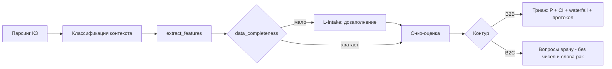

# Онкориск в Protocol: методология, данные, визуализация и план

> **Статус:** план (research + implementation), ревизия 2, 2026-06-30
> **Аудитория:** Павел + Cursor Agent + методслужба
> **Связано:** `config/red_flags.yaml`, `clinical_knowledge/safety_checker.py`, `clinical_knowledge/consult_schema.py`, `rag_server.py` (`_consult_oncology_flags`, `_consult_oncology_dual_scan`), `clinical_knowledge/patient_report_v2.py`, `patient-ui.js`, `docs/action-plan-master.md`, `docs/architecture-b2c-patient.md`
> **Принцип:** это **советующий** слой (decision-support / триаж), **не** диагноз и **не** send_gate. Подпись КЗ остаётся детерминированной по правилам.

---

## 0. Что пересмотрено в этой ревизии

Добавлено к ревизии 1 (то, что раньше не было учтено):

- **Контексты онко-оценки** разделены: симптоматический, скрининг, наблюдение после лечения, наследственный, детский (раздел 2).
- **Пациент уже на онко-учёте** - отдельная ветка: не пугать, не «подозревать», а поддержать маршрут наблюдения (раздел 2.3, 7).
- **Детская онкология** - свои сигналы и более низкий порог (раздел 2.5).
- **Продольность** - повтор симптома повышает PPV (CAPER repeat) (раздел 1, 5).
- **Приватность ПДн** - онко-данные чувствительны, контур L0/ЦИСЗ (раздел 9).
- **Точки интеграции в код** (раздел 8).
- **Строгая валидация/калибровка** и **model card** (раздел 10, 11).
- **Усиленные визуализация/оформление** (раздел 6) и **аккуратный B2C на уровне вопросов** (раздел 7).

---

## 1. Методология: как оценивается онкориск

Все подходы сводятся к **теореме Байеса**.

```
pre-test odds  = p0 / (1 - p0)            # p0 - заболеваемость по полу/возрасту (РБ)
post-test odds = pre-test odds × Π LR_i   # LR каждого признака из литературы
P = post-test odds / (1 + post-test odds)
```

**CAPER** (Hamilton, *Br J Cancer* 2009, DOI 10.1038/sj.bjc.6605396) - LR в первичном звене:

| Признак | Рак | LR | PPV (один) |
|---|---|---:|---|
| Ректальное кровотечение | колоректальный | 10 | 2.4% |
| Потеря веса | колоректальный / лёгкое | 5.1 / 6 | - |
| Боль в животе / диарея | колоректальный | 4.5 / 3.9 | - |
| Кровохарканье | лёгкое | 13 | 2.4% |
| Одышка / боль в груди / кашель | лёгкое | 4 / 3 / 2 | - |
| Задержка мочи / импотенция / частое мочеиспускание | простата | 9 / 9 / 7 | импотенция 3% |
| Гематурия | простата | 3 | - |
| Новый приступ / моторный дефицит | мозг | 96 / 21 | - |

Анализы (CAPER Table 3) - сильнейшие предикторы:

| Анализ | Рак | LR |
|---|---|---:|
| Кал на скрытую кровь (FOB) + | колоректальный | 31 |
| PSA > 4 нг/мл | простата | 29 |
| Тромбоцитоз | лёгкое | 19 |
| Hb < 10 г/дл (муж) / < 9 (жен) | колоректальный | 10 / 43 |

**Порог действия - NICE NG12:** PPV >= 3% -> путь подозрения на рак; для детей порог ниже. По локализациям:

| Локализация | Сигнал / порог |
|---|---|
| Неспецифичный | потеря веса > 5% за 6 мес, возраст >= 60 |
| Поджелудочная | желтуха PPV 4.1% (40+), растёт с возрастом |
| Пищевод/желудок | дисфагия (специфичность ~92%), вес, анемия |
| Яичник | CA-125: 40-49 >= 35; 50-59 >= 31; 60-69 >= 24 МЕ/мл |
| Молочная железа | пальпируемое образование -> срочно |
| Простата | PSA - возраст-специфично |

**Продольность:** повторное обращение с тем же симптомом повышает PPV (CAPER repeat presentations) - учитываем как множитель/отдельный LR.

**QCancer** (Hippisley-Cox; *BJGP* 2013 DOI 10.3399/bjgp13X660751; *BMJ* 2015; *Nat Commun* 2025 DOI 10.1038/s41467-025-57990-5) - многомерная модель (возраст, пол, ИМТ, курение, семейный анамнез, симптомы; Model B + анализы) - целевая модель будущего.

**Caveat независимости:** перемножение LR завышает риск при коррелирующих симптомах - shrinkage, парные PPV, кап, доверительный интервал.

---

## 2. Контексты онко-оценки (не путать)

Один и тот же текст КЗ требует разной реакции в зависимости от контекста. Сначала классифицируем контекст, потом считаем.

### 2.1. Симптоматический (основной)
Есть жалобы/находки -> Байes-оценка post-test вероятности -> триаж по 3%.

### 2.2. Скрининг (бессимптомный по возрасту)
Не риск-оценка, а **право на скрининг** по возрасту/полу (колоректальный FIT, цервикальный, маммография, обсуждение PSA). Источник возрастов - протоколы РБ. B2C: «уточните, показан ли вам скрининг по возрасту».

### 2.3. Наблюдение после лечения (пациент на онко-учёте)
Маркеры (химиотерапия, метастаз, TNM, онколог) означают, что пациент **уже в системе**. Тогда **не подозреваем заново и не пугаем** - поддерживаем график контроля. Детектируется по `_consult_oncology_dual_scan` (сильные маркеры лечения) + `condition_status`.

### 2.4. Наследственный риск
Семейный анамнез (BRCA, Линч) - модификатор priors. Поле `PatientContext.family_history`. B2C: «обсудите с врачом семейную историю и нужна ли консультация генетика».

### 2.5. Детский
КЗ имеет `adult_or_child`. У детей сигналы иные (стойкая лимфаденопатия, боль в костях, петехии, утренняя рвота) и **порог ниже**. Отдельная таблица LR/действий; B2C-вопросы - для родителя, максимально мягко.

---

## 3. Источники данных (приоритет - Беларусь, плюс мир)

### 3.1. Priors (заболеваемость) - Беларусь
**Первичный:** РНПЦ ОМР им. Н.Н. Александрова, Белорусский канцер-регистр, ежегодник «Статистика онкологических заболеваний в Республике Беларусь».

Структура РБ 2023 (~57 000 случаев; 2024 ~60 000):

| Мужчины | % | Женщины | % |
|---|---:|---|---:|
| Простата | 26.3 | Молочная железа | 24.6 |
| Лёгкое | 14.4 | Толстая кишка | 11.9 |
| Толстая кишка | 11.8 | Тело матки | 11.1 |
| Почка | 6.3 | Щитовидная железа | 5.5 |
| Желудок | 5.9 | Почка | 5.1 |

**Возрастные показатели:** IARC CI5-XII (по 5-летним группам, CSV) - белорусские регистры. **Fallback:** GLOBOCAN 2022 Belarus (46 402; кум. риск до 75 лет 28.6%; crude ~0.49%/год).

### 3.2. LR / PPV / пороги - мир
CAPER (LR), NICE NG12 + приложения (пороги, PPV по поджелудочной/пищеводу/яичнику/МЖ), QCancer (переменные).

### 3.3. Действия / скрининг - Беларусь
478 протоколов МЗ РБ (`novoobrazovaniya`, скрининг) -> действия, маршрутизация, возраст скрининга, онконастороженность.

> **TODO ингеста:** age/sex показатели РНПЦ (или CI5); возрастные пороги скрининга из протоколов РБ.

---

## 4. Маппинг на схему КЗ и достаточность данных

Схема (`consult_schema.py`) уже хранит почти всё; проблема - **фактическая заполненность**:

| Вход | Поле схемы | Заполненность в реальном КЗ |
|---|---|---|
| Возраст / пол | `PatientContext.age_years/sex` | высокая |
| МКБ | `ConsultationDiagnosis.icd10_code` | высокая-средняя |
| Симптомы | `sections.complaints/anamnesis` (текст) | средняя (NLP) |
| Длительность / повтор | свободный текст | низкая |
| Анализы (Hb/PSA/FOB/CA-125) | `ExamItem.result_value/abnormal_flag` | низкая-средняя |
| Курение / ИМТ / семейный анамнез | `PatientContext.social_history/bmi/family_history` | низкая |

**Вывод:** для симптом-уровневого Байеса данных чаще хватает; для QCancer-уровня - нет. Отсюда **уровень дозаполнения** и **completeness score**.

| Полнота | Поведение |
|---|---|
| `< 0.4` | качественный сигнал + запуск L-Intake |
| `0.4-0.7` | оценка с широким CI + предложение дозаполнить |
| `>= 0.7` | оценка с узким CI |

---

## 5. Уровень дозаполнения (L-Intake)

Гейт между парсингом КЗ и расчётом.



Минимальный набор для количественной оценки: возраст, пол; >= 1 значимый симптом + длительность; профильные анализы (если есть); факторы риска (курение, семейный анамнез) - для апгрейда.

- **B2B:** форма «Дозаполните для онконастороженности» поверх `PatientContext`.
- **B2C:** вместо формы - подсказки, что уточнить у врача (см. раздел 7).

---

## 6. Визуализация и оформление

Цель - **аккуратно и красиво**, единый дизайн с проектом (design tokens из wave B, a11y из wave A). Два разных визуальных языка для B2B и B2C.

### 6.1. B2B (врач) - аналитическая панель
- **Evidence waterfall:** старт pre-test -> вклад каждого признака (×LR) -> post-test %; цвет по порогу 3% (ниже/выше).
- **Шкала-термометр** post-test vs порог 3% с зонами (low / low-not-no / refer).
- **Beta credible interval** (плотность) вокруг оценки - честный разброс.
- **Кольцо data-completeness** (0-1) - сколько входов заполнено.
- **Карточка источника** под каждым признаком: LR, ссылка (DOI/протокол).
- Реализация: интерактив в UI (consult) + статичный экспорт matplotlib PNG в `output/onco_risk/` для отчёта методиста; опционально Cursor Canvas для внутреннего разбора.

### 6.2. B2C (пациент) - мягкая карточка «Вопросы врачу»
- **Без графиков риска, без процентов, без слова «рак».** Никаких «термометров риска».
- Спокойная карточка-чеклист «Что полезно уточнить у врача» с нейтральными иконками, тёплая палитра, крупный читабельный шрифт.
- Кнопки **«Скопировать вопросы»** и **«Распечатать»** - пациент берёт список на приём.
- Индикатор не риска, а **«что ещё стоит уточнить»** (полнота как помощь, не тревога).
- a11y: контраст, ARIA-роли, смысл не только цветом, формулировки на простом языке.

### 6.3. Принципы оформления (оба контура)
- Единые токены (цвет/типографика/радиусы), консистентно с `index.html`/`patient.html`.
- Тире - короткий дефис с пробелами (правило проекта), без em/en dash в UI-текстах.
- Печать/PDF-дружелюбно (как существующие отчёты).

---

## 7. B2C: аккуратно, на уровне правильных вопросов

**Жёсткие правила тона:**
- Пациенту **не показываем** вероятность, не пишем «рак/онкология/злокачественный/опухоль», не ставим диагноз.
- Только **наводящие вопросы врачу** и темы для обсуждения; поддерживающий, не тревожный тон; простой язык.
- Источник формулировок - рекомендованные обследования из протокола (`recommendations_exams`), не «страшилки».
- Всегда **safety-netting**: когда вернуться к врачу, если симптом сохраняется.
- Если пациент **уже на онко-учёте** (контекст 2.3) - не «подозреваем», а поддерживаем график контроля и вопросы про наблюдение.

**Примеры (нейтральные):**
- «Уточните у врача причину снижения веса и какие обследования её прояснят.»
- «Спросите, целесообразен ли анализ кала на скрытую кровь при жалобах со стороны кишечника.»
- «Уточните, нужен ли контроль гемоглобина и в какой срок повторно показаться.»
- «Спросите, показан ли вам скрининг по возрасту.» (контекст скрининга)
- «Обсудите семейную историю заболеваний и нужна ли консультация генетика.» (наследственный)
- «Уточните график контрольных обследований по вашему наблюдению.» (на учёте)

**Do / Don't:**

| Do | Don't |
|---|---|
| «уточнить причину», «обсудить обследование» | «у вас риск рака N%» |
| вопросы + когда вернуться | диагноз/прогноз |
| простой язык, поддержка | медицинский жаргон, тревога |
| ссылка на решение врача | самостоятельные выводы |

Проверяется тестом: `forbidden_words` отсутствуют в B2C-выводе; каждый вопрос имеет нейтральный тон.

---

## 8. Архитектура и точки интеграции

```
data/onco_risk/
  likelihood_ratios.yaml      # признак -> {icd, cancer_site, LR, ppv_single, страта, источник+DOI}
  priors_belarus.yaml         # заболеваемость РБ (РНПЦ; CI5 возраст; GLOBOCAN fallback)
  thresholds_nice_ng12.yaml   # порог 3%, возрастные пороги, CA-125/PSA/вес
  screening_belarus.yaml      # возраст/пол скрининга из протоколов РБ
  pediatric_signals.yaml      # детские сигналы + действия
  required_inputs.yaml        # минимальный набор входов -> L-Intake / completeness
  b2c_question_templates.yaml # нейтральные вопросы (forbidden_words), привязка к recommendations_exams
  sources.md                  # библиография DOI/URL + даты доступа

clinical_knowledge/onco_risk.py
  - classify_context(doc) -> symptomatic | screening | surveillance | hereditary | pediatric
  - extract_features(doc, labs) -> Features
  - data_completeness(features) -> {score, missing[]}
  - posterior_risk(features) -> {site: {p, ci_low, ci_high, contributors[]}}
  - any_cancer_risk(...) -> {p, ci, triage_level}
  - b2c_questions(features, context) -> list[str]

scripts/onco_risk_demo.py     # визуализация waterfall/Beta CI -> output/onco_risk/*.png
tests/test_onco_risk.py       # формулы, пороги, completeness, контексты, B2C без «страшных» слов
```

**Точки интеграции:**
- B2B: рядом с `_consult_oncology_flags` в consult-флоу `rag_server.py` - добавить advisory-блок (не gate).
- B2C: в `patient_report_v2.py` / `patient-ui.js` - блок «Вопросы врачу».
- Рантайм - **только локальный lookup + арифметика**, без вызовов API (быстро, on-prem, подходит для L0).

---

## 9. Guardrails, приватность, регуляторика

- **Только decision-support.** Не блокирует ЭЦП, не заменяет 482 правила, send_gate детерминированный.
- **Каждое число - со ссылкой** (DOI / протокол / ежегодник РНПЦ + дата доступа).
- **Приватность ПДн:** онко-данные чувствительны; расчёт в контуре, без выноса ПДн на L0; логировать обезличенно.
- **Независимость признаков** - честно как допущение (shrinkage + парные PPV + кап + CI).
- **Калибровка под РБ** - LR переносим, priors белорусские.
- **B2C - не пугать** (раздел 7), запрет «страшных» слов, без процентов.
- **Data-insufficient** -> L-Intake, не ложная точность.

---

## 10. Валидация и калибровка

- **Метрики:** калибровочная кривая (predicted vs observed), Brier score, AUC, decision-curve analysis (чистая польза при пороге 3%).
- **Без локальных исходов:** проверка воспроизводимости опубликованных PPV (sanity), затем накопление обратной связи методслужбы как proxy-меток.
- **Рекалибровка priors** под РБ (CI5/РНПЦ возраст) перед продом.
- **Gate:** не хуже базового качественного триажа; CI честный; нет регрессии на тестовых КЗ.

---

## 11. Поэтапный план

| Фаза | Содержание | Кошелёк | Gate |
|---|---|---|---|
| **0. Данные** | `data/onco_risk/*.yaml`: LR, priors РБ, пороги, скрининг, детские сигналы, required_inputs, b2c-шаблоны; `sources.md` | $0 + web | ревью методиста; каждая цифра с источником |
| **1. Движок** | `onco_risk.py`: context + features + completeness + Байes + CI; тесты | Cursor Auto | формулы покрыты тестами; пример воспроизводится |
| **2. L-Intake** | гейт дозаполнения: B2B форма + B2C генератор вопросов | Cursor Auto | при низкой полноте - дозаполнение; B2C без «страшных» слов (тест) |
| **3. Визуализация** | B2B waterfall/CI/термометр; B2C мягкая карточка «вопросы врачу» (токены, a11y, печать) | Cursor Auto | единый дизайн; B2C тон нейтральный; PNG-экспорт |
| **4. Интеграция** | advisory в consult (`rag_server`) и блок в `patient_report_v2`/`patient-ui` | Cursor Auto | не gate; источники видны; локальный рантайм |
| **5. Анализы** | парсинг будущих анализов -> LR -> Model B | Cursor Auto | прирост completeness |
| **6. Калибровка** | рекалибровка priors РБ, валидация (раздел 10), model card | $0 + Opus | калибровка ок; model card опубликована |

---

## 12. Model card (выпустить в Фазе 6)

Короткий документ: назначение (триаж, не диагноз), входы/выходы, источники LR/priors и версии, допущения (независимость, UK-калибровка LR), ограничения (детская/редкие локализации), метрики валидации, контуры (B2B/B2C), запреты (не gate, B2C без чисел), дата и версия базы знаний.

---

## 13. Риски и антипаттерны

| Не делать | Почему |
|---|---|
| Переносить UK PPV без калибровки | другая заболеваемость РБ |
| Перемножать LR без поправки | завышение при коррелирующих симптомах |
| Одна цифра без CI | ложная точность |
| Считать риск при пустых входах | вместо этого L-Intake |
| Показывать пациенту % и слово «рак» | паника, вред; вместо этого вопросы |
| Пугать пациента, уже стоящего на учёте | контекст наблюдения, поддержать |
| Онко-риск в send_gate | подпись детерминированная |
| Выдумывать LR/priors | недопустимо клинически и нерегуляторно |

---

## 14. Источники

1. NICE NG12. Suspected cancer: recognition and referral. https://www.nice.org.uk/guidance/ng12
2. Hamilton W. The CAPER studies. *Br J Cancer* 2009;101(S2):S80-86. DOI 10.1038/sj.bjc.6605396
3. Hippisley-Cox J, Coupland C. (QCancer). *BJGP* 2013;63(606):e11/e30. DOI 10.3399/bjgp13X660751
4. Hippisley-Cox J, Coupland C. (QCancer). *BMJ* 2015.
5. QCancer development/external validation. *Nat Commun* 2025. DOI 10.1038/s41467-025-57990-5
6. IARC GLOBOCAN 2022, Belarus fact sheet. https://gco.iarc.who.int (доступ 2026-06-30)
7. IARC/IACR. Cancer Incidence in Five Continents (CI5), vol. XII. https://ci5.iarc.who.int (доступ 2026-06-30)
8. РНПЦ ОМР им. Н.Н. Александрова. Белорусский канцер-регистр. Ежегодник «Статистика онкологических заболеваний в Республике Беларусь». https://omr.by
