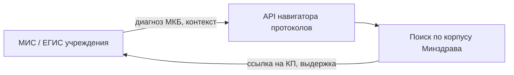

# Дорожная карта: интеграция с МИС / ЕГИС

**Этап 2** — после успешного пилота на веб-интерфейсе. Сроки определяются заказчиком.

## Планируемые endpoint'ы

| Метод | Назначение |
|-------|------------|
| `POST /api/assist` | Уже есть: подбор протоколов |
| `POST /api/icd-suggest` | Уже есть: МКБ по жалобе |
| `POST /api/consult-review` | Уже есть: сверка КЗ (PDF) |
| `GET /api/corpus-stats` | Версия корпуса для отображения в МИС |

## Польза для системы здравоохранения

- Единая точка доступа к **актуальным** протоколам Минздрава в рабочем месте врача.
- Снижение «свободного текста» в КЗ без опоры на стандарт.
- Агрегированная аналитика по учреждению (без ПДн в отчётах) — зоны риска по критериям.
