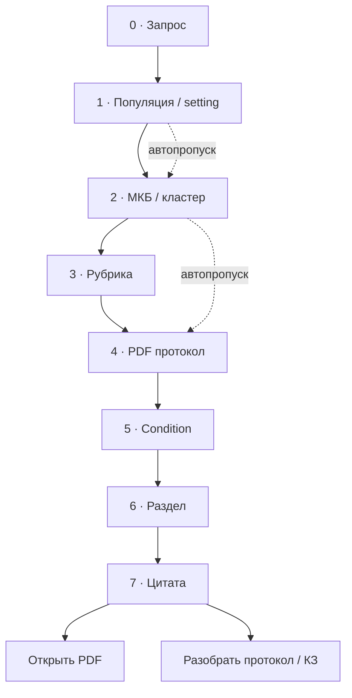

# Воронка поиска протоколов (v1)

**Проект:** Protocol  
**Версия:** 1.0  
**Дата:** июнь 2026  
**Сборка:** r135+  
**Статус:** проектирование  
**Цель:** врач **один раз** вводит запрос; дальше сужает выбор **только кнопками** до нужного PDF и выдержки. Методист замыкает контур улучшения на каждом шаге воронки.

**Связанные документы:**

- Навигация поиска: фазы A-D, KPI (исторический план удалён)  
- [search-methodist-roadmap.md](./search-methodist-roadmap.md) - режим методиста, compact UI  
- [protocol_summary_acceptance_audit.md](./protocol_summary_acceptance_audit.md) - YAML summaries, summary_chunks  
- `clinical_knowledge/protocol_summary/nav.py` - TOC разделов для UI  

---

## 1. Принцип

| Было (flat RAG) | Станет (воронка) |
|-----------------|------------------|
| Один `/api/assist` → 6-10 протоколов с длинными цитатами | 7-8 коротких шагов, ≤6 кнопок на шаг |
| LLM-ranking + «Оценка ИИ» | `retrieve_only` + score только как tie-break |
| Повторный ввод / правка запроса | Контекст накапливается в сессии; «← Назад» |
| Методист оценивает только top-1 PDF | Методист размечает **ошибку на конкретном шаге** воронки |

**UX-правила:**

1. Не больше **6 кнопок** на шаг; остальное - «Ещё варианты».
2. **Автопропуск** шага при высокой уверенности (МКБ уже в запросе → пропуск шага 2).
3. **Цитаты и PDF** - только на финальном шаге (режим «только цитаты» по умолчанию).
4. Поле запроса **не очищается**; кнопки дополняют `funnel_context`, не заменяют текст.

---

## 2. Схема воронки

```text
[0] Свободный запрос (один раз)
      ↓
[1] Контекст пациента     → кнопки: взрослые / дети / беременность / неотложно
      ↓
[2] Код / кластер МКБ     → кнопки: J20.9, J18.9, … (из icd-suggest)
      ↓
[3] Рубрика               → кнопки: пульмонология, педиатрия, …
      ↓
[4] Протокол (PDF)        → кнопки: название КП + год + %
      ↓
[5] Нозология внутри КП   → conditions[] из Protocol Summary (один PDF - несколько болезней)
      ↓
[6] Раздел протокола      → критерии / обследования / лечение / red flags / наблюдение
      ↓
[7] Выдержка + ссылка PDF → blockquote + page/section из source_ref
```



---

## 3. Шаги: данные и статус

| Шаг | UI (кнопки) | Источник | Статус |
|-----|-------------|----------|--------|
| 0 | Textarea + «Найти» | Ввод пользователя | ✅ |
| 1 | Популяция, setting | контекст в запросе; `audience_inferred` на assist | ✅ r135 UI |
| 2 | Коды МКБ-10 | `POST /api/icd-suggest`, кластеры ICD | ✅ r134 stepper |
| 3 | Рубрика | `query_specialties`, routing, top рубрик retrieval | ❌ |
| 4 | Список PDF | RAG dedup, `retrieve_only`; **summary-first** при МКБ | ⚠️ retrieve_only ✅; summary RAG ❌ |
| 5 | Condition | `conditions[]` в YAML (~470 протоколов) | ❌ |
| 6 | Раздел | `nav.py` → criteria / exams / treatment / red_flags / follow_up | ❌ |
| 7 | Цитата | PDF chunk + `source_ref`; `summary_chunks.jsonl` | ⚠️ PDF ✅; summary chunks не в RAG |

---

## 4. Структура протоколов для воронки

### 4.1 Protocol Summary Card (основа шагов 5-7)

Уже описано в `clinical_knowledge/protocol_summary/schema.py`:

```yaml
protocol_id, source.local_path, rubric
conditions:
  - title_ru, icd_codes[], population, care_setting
    clinical_criteria, diagnostic_criteria
    required_exams, conditional_exams
    treatment, red_flags, follow_up
    source_refs: [page, section_title, quote]
```

**Пробел:** `data/protocol_summaries/summary_chunks.jsonl` (~10 648 строк) **не подключён к RAG** - см. [protocol_summary_acceptance_audit.md](./protocol_summary_acceptance_audit.md).

### 4.2 Оси ветвления (параметры кнопок)

| Ось | Шаг | Примеры кнопок |
|-----|-----|----------------|
| `population` | 1 | «≥18 лет», «дети», «беременные» |
| `care_setting` | 1 | «амбулаторно», «стационар», «неотложно» |
| `icd_cluster` | 2 | «J18.x пневмония», «J20.x бронхит» |
| `rubric` / specialty | 3 | «Пульмонология», «Педиатрия» |
| `protocol_path` | 4 | «КП внебольничная пневмония 2023» |
| `condition_id` | 5 | «ВП впервые диагностированная» |
| `section_id` | 6 | «Обследование», «АБТ», «Госпитализация» |

### 4.3 Похожие части между протоколами

Общие блоки («жаропонижающая при T>39 у детей», «критерии госпитализации») встречаются в нескольких КП.

**Подход (фаза D+):**

- кластеризация чанков по embedding → `pattern_id`;
- методист помечает «тот же смысл, что в КП X»;
- в UI: «Похожие формулировки» - **после** шага 6, не в top-list шага 4.

### 4.4 API воронки (целевой контракт)

```http
POST /api/search/funnel
{
  "query": "кашель и температура 39",
  "step": 2,
  "context": {
    "population": "adult",
    "icd_codes": [],
    "rubric_slugs": [],
    "protocol_path": null,
    "condition_id": null,
    "section_id": null
  },
  "category_slugs": []
}
```

**Ответ:**

```json
{
  "step": 2,
  "auto_skip": false,
  "choices": [
    {"id": "J18.9", "label": "J18.9 · Пневмония неуточнённая", "confidence": 0.82}
  ],
  "context": { "...": "обновлённый контекст" }
}
```

На шаге 7 - `excerpt`, `pdf_href`, `source_ref` вместо `choices`.

Пока шаги 0-4 реализованы через `/api/assist` + `retrieve_only` и stepper в `index.html` (r134).

---

## 5. Режим методиста: непрерывное улучшение

### 5.1 Роли

| Роль | В воронке |
|------|-----------|
| **Врач** | Проходит шаги 0-7; не видит AI-summary |
| **ИИ (methodist)** | Meta-review ranking + `suggested_funnel` (на каком шаге ошибка) |
| **Методист** | Одобряет / правит → `feedback` с `funnel_step` |
| **Движок** | routing, summary RAG, golden eval |

### 5.2 Теги и события (расширение r133)

| Тег / поле | Шаг воронки |
|------------|-------------|
| `query_too_vague` | 0 → принудить шаг 2 |
| `wrong_population` | 1 |
| `wrong_icd_suggestion` | 2 (новый) |
| `wrong_rubric` | 3 (новый) |
| `wrong_protocol` | 4 |
| `missed_protocol` | 4 |
| `wrong_condition` | 5 (новый) |
| `wrong_section` | 6 (новый) |

**События feedback:**

- `search_review` - воронка верна end-to-end;
- `retrieval_fix` - `rejected_path`, `chosen_path`, **`funnel_step`**, **`funnel_context`**, `retrieval_top_paths`.

### 5.3 Замкнутый цикл

```text
Врач (воронка) → telemetry protocol_search
              → методист + search-ai-review
              → feedback JSONL
              → queue (domain=search) + golden queries
              → CI Hit@k по шагам
              → правки rag_server / summary RAG
              → deploy → снова воронка
```

**Еженедельный минимум методиста:**

1. Разобрать очередь `GET /api/methodist/queue?domain=search` (B4).
2. 10-20 прогонов golden queries (symptom / МКБ / mixed).
3. Проверить дашборд «Поиск · оценки»: Hit@1, Hit@3, AI-approved rate.
4. При ≥20 `retrieval_fix` - прогон CI eval (B3).

### 5.4 Три скорости улучшений

| Скорость | Что меняется | Источник |
|----------|--------------|----------|
| Дни | routing boost, ICD pre-filter, population gate | `engine_improvements_ru` |
| Недели | summary-first RAG, pre-filter рубрики | B1, B2 |
| Месяцы | YAML → `reviewed/`, pattern clusters | методист + validator |

---

## 6. Метрики воронки

| Метрика | Описание | Цель |
|---------|----------|------|
| **Step accuracy** | % сессий без `retrieval_fix` на шаге N | ≥80% на шаге 4 |
| **Hit@1 / Hit@3** | Правильный PDF в top-1 / top-3 (шаг 4) | Hit@3 ≥60% |
| **Skip rate** | Доля автопропусков шагов 1-2 | мониторинг |
| **Time to excerpt** | От submit до шага 7 | <30 с (retrieve_only) |
| **MKB adoption** | Доля сессий с кодом после шага 2 | +15% |
| **Summary coverage** | PDF с usable YAML для шагов 5-6 | top-50 запросов 100% |

---

## 7. История реализации

| BUILD | Шаги воронки |
|-------|----------------|
| r128-r132 | dedup, lite assist, citations-only, methodist compact |
| r133 | methodist AI-review, search dashboard |
| r135 | шаг 1 популяция, deterministic search-ai-review fallback, symptom rerank |
| r134 | шаги 0-2-4 (stepper), retrieve_only, compact list → detail |

---

## 8. Задачи для GitHub Issues (фазы B и C)

Ниже - готовые текста issues. Labels: `search`, `funnel`, `phase-B` / `phase-C`, `methodist`.

---

### Issue B1 - Summary-first retrieval при МКБ в query

**Labels:** `search`, `phase-B`, `rag`, `priority-high`

**Описание**

Подключить `data/protocol_summaries/summary_chunks.jsonl` к пайплайну `retrieve()`: при явном коде МКБ в запросе сначала искать по summary-чанкам (`overview`, `icd`, `condition_title`), затем дополнять raw PDF chunks.

**Критерии приёмки**

- [ ] `retrieve()` объединяет raw + summary corpora с пометкой `kind=summary_*`.
- [ ] При `icd_codes_for_lex` не пустом - boost summary-чанков с matching ICD.
- [ ] Hit@1 на golden set (МКБ-only queries) не ниже baseline −5% и цель +10% после tuning.
- [ ] Тесты: `tests/test_summary_retrieval.py` (fixture 3-5 протоколов).

**Зависимости:** нет  
**Файлы:** `rag_server.py`, `clinical_knowledge/protocol_summary/summary_to_rag.py`

---

### Issue B2 - Pre-filter рубрика + МКБ до embed rerank

**Labels:** `search`, `phase-B`, `rag`

**Описание**

До embed rerank отфильтровать кандидатов: пересечение `user_category_slugs`, inferred specialty и протоколов с ICD в summary/index.

**Критерии приёмки**

- [ ] Pre-filter уменьшает pool rerank минимум на 30% для запросов с МКБ+рубрикой.
- [ ] Нет регрессии recall на golden mixed queries.
- [ ] Лог `routing_version` / debug flag для методиста.

**Зависимости:** B1 (желательно)  
**Файлы:** `rag_server.py`, `clinical_knowledge/protocol_summary/icd_index.py`

---

### Issue B3 - Golden queries + CI eval для поиска

**Labels:** `search`, `phase-B`, `ci`, `methodist`

**Описание**

Фикстура `tests/fixtures/search_golden.jsonl`: query, expected_path, query_type (symptom|icd|mixed), funnel_step=4. CI: Hit@1, Hit@3, MRR.

**Критерии приёмки**

- [ ] ≥30 размеченных запросов (мин. 10 symptom, 10 icd, 10 mixed).
- [ ] `pytest tests/test_search_golden.py` в CI.
- [ ] Отчёт в артеfact / methodist stats snapshot.

**Зависимости:** B1  
**Связано:** methodist `retrieval_fix` → пополнение golden set

---

### Issue B4 - Очередь methodist queue domain=search

**Labels:** `search`, `phase-B`, `methodist`

**Описание**

`GET /api/methodist/queue?domain=search` - приоритет: AI `ranking_verdict` ∈ {partially_wrong, wrong}, низкий Hit@3, `query_too_vague` без follow-up.

**Критерии приёмки**

- [ ] API возвращает id, query_hash, verdict, top_paths, created_at (без полного текста запроса в логах UI - опционально маскирование).
- [ ] Вкладка методиста «Очередь · поиск» или фильтр в существующей queue.
- [ ] Документация в `docs/search-funnel-v1.md` §5.3.

**Зависимости:** r133 search-ai-review ✅

---

### Issue B5 - Обязательный rejected_path при wrong_protocol

**Labels:** `search`, `phase-B`, `methodist`, `ux`

**Описание**

В UI методиста: при теге `wrong_protocol` нельзя сохранить `retrieval_fix` без `rejected_path` (top-1 из выдачи).

**Критерии приёмки**

- [ ] Client-side + server-side validation в `feedback_store`.
- [ ] Подсказка в форме методиста.
- [ ] Unit test на reject пустого rejected_path.

**Зависимости:** нет

---

### Issue B6 - funnel_step и funnel_context в feedback

**Labels:** `search`, `phase-B`, `funnel`, `methodist`

**Описание**

Расширить schema `retrieval_fix` / `search_review`: поля `funnel_step` (0-7), `funnel_context` (JSON), новые теги `wrong_rubric`, `wrong_condition`, `wrong_section`, `wrong_icd_suggestion`.

**Критерии приёмки**

- [ ] `feedback_store.py` валидирует новые поля.
- [ ] UI методиста: dropdown «На каком шаге ошибка».
- [ ] `methodist_stats.search` - breakdown по funnel_step.
- [ ] AI-review prompt: optional `suggested_funnel_step`.

**Зависимости:** B4  
**Файлы:** `clinical_knowledge/feedback_store.py`, `methodist_search_ai_review.py`, `index.html`

---

### Issue C1 - Stepper жалобы → МКБ → протокол

**Labels:** `search`, `phase-C`, `funnel`, `ux`

**Описание**

Пошаговый UI: ICD chips → compact protocol list → single excerpt → back navigation. Citations-only по умолчанию. `retrieve_only` для списка.

**Критерии приёмки**

- [x] r134: stepper, wizard bar, retrieve_only, limit 4+2 protocols.
- [ ] Документировано в funnel v1 ✅ (этот файл).

**Статус:** ✅ done r134

---

### Issue C2 - Шаг 1 воронки: популяция и care_setting

**Labels:** `search`, `phase-C`, `funnel`, `ux`, `priority-high`

**Описание**

После submit, если population не выведена однозначно - экран с 3-5 кнопками (взрослые / дети / беременные / неотложно). Контекст → `funnel_context.population`, `care_setting`. Автопропуск при явных маркерах в тексте.

**Критерии приёмки**

- [x] UI шаг 1 с «← Назад» к запросу (r135).
- [x] Контекст аудитории добавляется в запрос перед ICD/assist.
- [ ] `retrieve()` получает audience filter до шага 4 (backend routing).
- [ ] Методист: тег `wrong_population` привязан к шагу 1.

**Статус:** 🟡 частично (r135 UI)

**Зависимости:** C1 ✅  
**Файлы:** `index.html`, `rag_server.py` (`filter_retrieval_by_audience`)

---

### Issue C3 - Шаг 3 воронки: выбор рубрики

**Labels:** `search`, `phase-C`, `funnel`, `ux`

**Описание**

Кнопки top-3 рубрик из retrieval / `query_specialties`. Выбор сужает `category_slugs` для шага 4.

**Критерии приёмки**

- [ ] Не показывать шаг 3, если рубрика уже выбрана в toolbar или одна рубрика с confidence >0.85.
- [ ] ≤6 кнопок + «Все рубрики».
- [ ] `wrong_rubric` в feedback (после B6).

**Зависимости:** C1, B2 (желательно)

---

### Issue C4 - Шаги 5-6: condition + section (Protocol Summary TOC)

**Labels:** `search`, `phase-C`, `funnel`, `protocol-summary`, `priority-high`

**Описание**

После выбора PDF - если есть YAML summary: кнопки `conditions[]`, затем разделы из `nav.py` (criteria, exams, treatment, red_flags, follow_up). Клик → excerpt API по `source_ref`.

**Критерии приёмки**

- [ ] `GET /api/protocol-summary/nav?path=...` или reuse `find_summary_by_catalog_path`.
- [ ] Шаг 5 пропускается, если condition одна.
- [ ] Шаг 7 отдаёт quote + page без LLM.
- [ ] Fallback: только PDF excerpt (как сейчас), без падения UI.

**Зависимости:** B1, C1  
**Файлы:** `clinical_knowledge/protocol_summary/nav.py`, `rag_server.py`, `index.html`

---

### Issue C5 - API POST /api/search/funnel

**Labels:** `search`, `phase-C`, `funnel`, `api`

**Описание**

Единый endpoint воронки с `step` + `context` вместо множества ad-hoc вызовов assist/icd-suggest.

**Критерии приёмки**

- [ ] Контракт из §4.4 этого документа.
- [ ] Session id (cookie или client UUID) для телеметрии по шагам.
- [ ] `index.html` переведён на funnel API для шагов 1-7.
- [ ] OpenAPI / README endpoint table.

**Зависимости:** C2, C3, C4, B6

---

### Issue C6 - Lazy KZ matrix (только запрошенный блок)

**Labels:** `search`, `phase-C`, `kz`, `ux`

**Описание**

«Разобрать протокол» загружает один блок матрицы КЗ (жалобы / обследование / лечение), не всю матрицу 30+ пунктов сразу.

**Критерии приёмки**

- [ ] Tabs матрицы = lazy fetch per section.
- [ ] Первый экран ≤10 пунктов.
- [ ] Кэш по path+ICD+section (N5 из plan v2).

**Зависимости:** C4  
**Файлы:** `index.html`, `/api/protocol-practical` или аналог

---

### Issue C7 - Экран «КЗ по выбранному протоколу»

**Labels:** `search`, `phase-C`, `kz`, `ux`

**Описание**

После шага 7 - CTA «Оформить черновик КЗ»: протокол + выбранный section + чек-лист блоков КЗ на одном экране.

**Критерии приёмки**

- [ ] Переход search → consult-review с prefill protocol_path, icd, excerpt.
- [ ] Не дублировать полную матрицу без запроса.

**Зависимости:** C6  
**Связано:** N4 (навигация поиска)

---

## 9. Приоритет внедрения (рекомендация)

```text
Сейчас (r134) ──► C2 (population) + B1 (summary RAG)
       ──► C3 (rubric) + B2 (pre-filter)
       ──► B3 + B4 + B6 (methodist loop по шагам)
       ──► C4 (condition/section)
       ──► C5 (единый funnel API)
       ──► C6-C7 (KZ integration)
       ──► Phase D (embedder) после ≥20 retrieval_fix
```

---

## 10. Changelog документа

| Версия | Дата | Изменения |
|--------|------|-----------|
| 1.0 | 2026-06 | Первая версия: воронка 0-7, методист loop, issues B1-B6, C1-C7 |
