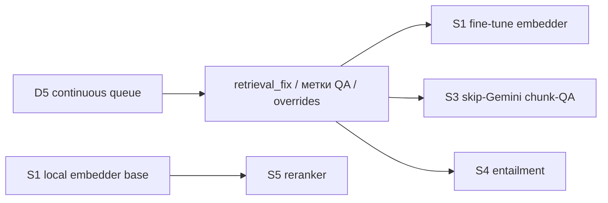

# План: тренированные модели для ускорения Protocol

**Проект:** Protocol
**Версия документа:** 1.0
**Дата:** июнь 2026
**Связанные документы:** [ml/README.md](../ml/README.md), [methodist-ml-priority-plan.md](./methodist-ml-priority-plan.md), [cursor-spend-checklist.md](./cursor-spend-checklist.md)

---

## 0. Идея и принцип

Цель - убрать главные источники латентности и стоимости: удалённые вызовы Gemini (embedding, ICD/routing/refine, L2-критерии, chunk-QA). Везде, где это безопасно, заменяем сетевой LLM-вызов на **локальную обученную модель** в контуре РБ.

**Не заменяем нейросетью** детерминированное ядро: `send_gate`, `compliance_gate`, правила 482+, ЦИСЗ. Принцип из `ml/README.md`.

Каркас уже есть в репозитории (`ml/train/*`, `ml/registry/model_manifest.json`), он описан под качество. Этот документ переосмысливает тот же слой под **скорость** и фиксирует порядок внедрения.

---

## 1. Где сегодня узкие места по скорости

| Источник | Где в пайплайне | Природа задержки |
|----------|-----------------|------------------|
| Embedding-вызовы Gemini | каждый retrieve + каждая офлайн-пересборка | сетевой round-trip на чанк (~1.1/с), упор в сеть и квоты |
| Gemini ICD-инференс / routing / refine | `/api/assist`, tier S2 | секунды и $ на запрос |
| Gemini L2-критерии / explainer | анализ КЗ, L2 | дорогой «хвост» при масштабе 1000 КЗ/день |
| Gemini chunk-QA | офлайн, Wave A / continuous queue (D5) | объёмные $ и время |

Эталонный пример боли: пересборка эмбеддингов (D2) идёт ~20 ч именно из-за per-chunk API round-trip.

### Замеренный baseline (июль 2026, 9 реальных КЗ, локально)

| Слой | На 1 КЗ | 1000 КЗ последовательно | 1000 КЗ @ 8 воркеров |
|------|---------|-------------------------|----------------------|
| L1 структурный (парсинг + матчинг протоколов, **без LLM**) | **~19 мс** | **~19 с** | **~2.4 с** |

Вывод: сам структурный слой уже «моментальный». «Не-моментальность» на 1000 КЗ создают только сетевые вызовы Gemini (ICD-инференс, L2-критерии). Задача обучения = вынести каждый такой вызов из горячего пути в локальную модель.

**Приоритет зависит от цели:**
- **офлайн-пересборка эмбеддингов** → топ-рычаг S1 (20 ч → минуты);
- **онлайн-батч «моментально на 1000 КЗ»** → топ-рычаг S2 (убирает Gemini-ICD из горячего пути); dense-retrieval закрыт по итогам A/B (см. `dense-ab-benchmark.md`), поэтому онлайн-эффект S1 малый.

---

## 2. Чек-лист внедрения (по приоритету скорость-ROI)

### S1 - Локальный embedder-бэкенд (наивысший ROI, работает уже сейчас)

- [ ] Включить `RAG_EMBED_BACKEND=local` на базовой локальной модели (fine-tune не требуется для выигрыша по скорости).
- [ ] Прописать активную модель в `ml/registry/model_manifest.json`.
- [ ] Gate: `python3 scripts/run_ab_embedder_kz.py` - consult_gold не хуже + golden RAG не хуже.
- [ ] Замерить латентность retrieve (онлайн) и время полной пересборки (офлайн).
- [ ] (Позже, для качества) fine-tune: `python3 ml/train/finetune_embedder.py --dataset ml/datasets/retrieval_pairs_resolved.jsonl`.

**Файлы:** `ml/train/finetune_embedder.py`, `ml/registry/model_manifest.json`, `scripts/run_ab_embedder_kz.py`
**Данные:** `ml/datasets/retrieval_pairs_resolved.jsonl` - **308 пар** (query → positive_path + текст); база работает без обучения.
**Выигрыш:** онлайн retrieve - сетевой round-trip → десятки мс; офлайн-пересборка эмбеддингов (как D2) - **часы → минуты**, без зависимости от квот.
**Блокер скорости:** нет (база работает сразу). Fine-tune-качество упирается в ≥50 `retrieval_fix` (сейчас ~12 feedback-событий в `data/ml/feedback/retrieval_fix*.jsonl` + 3 в `retrieval_fix_gold`).

### S2 - Классификатор query → ICD / рубрика / специальность

- [ ] Собрать датасет query→label из feedback + structured_index.
- [ ] Обучить (инфра `ml/train/train_chunk_classifier.py`, Hashing + OvR LogReg, обучение ~секунды).
- [ ] Включить как быстрый путь S1 / retrieve_only вместо Gemini ICD-инференса в `/api/assist`.
- [ ] Gate: `python3 scripts/run_symptom_icd_probe.py --local --no-gemini` - top-1 plausible не хуже baseline.

**Файлы:** `ml/train/train_chunk_classifier.py`, `scripts/run_symptom_icd_probe.py`
**Данные:** `data/ml/analyses/*.json` (**84 реальных анализа**: текст КЗ → выданные ICD/рубрика), `data/ml/feedback/kz_analysis.jsonl`, `structured_index.json` (**451 протокол** = справочник меток); eval - `ml/datasets/kz_regression.jsonl` (9).
**Выигрыш:** секунды → <100 мс на маршрутизацию, без LLM в горячем пути. **Топ-рычаг под онлайн-батч 1000 КЗ.**
**Блокер:** нет (дёшево обучить); на прототип данных хватает (84 + справочник 451), устойчивость растёт через D5.

### S3 - Skip-Gemini классификатор chunk-QA

- [ ] Добрать метки chunk-QA (источник - continuous queue D5).
- [ ] Переобучить `chunk_classifier` и пройти P0 gate (F1 ≥ 0.85 по `preamble_leak`, чисто по `icd_inflation`).
- [ ] При прохождении gate включить skip-Gemini для чанков, помеченных «QA не нужен».

**Файлы:** `ml/train/train_chunk_classifier.py`, `ml/experiments/chunk_classifier_v1/REPORT.md`
**Данные:** `ml/datasets/chunk_qa_classifier.jsonl` - **25 984 размеченных чанка** (самый богатый датасет), + `data/ml/chunk_qa_fixes*.jsonl`.
**Выигрыш:** режет объём Gemini chunk-QA в Wave A / D5 (стоимость + время). Это **офлайн-эффект** - не онлайн-латентность 1000 КЗ.
**Блокер:** сейчас gate FAIL (`preamble_leak` F1 0.63 < 0.85, `icd_inflation` мало примеров) - нужна доразметка сложных классов (данных по объёму много).

### S4 - Локальный entailment matcher (критерии L2)

- [ ] Накопить ≥100 пар `entailment_pairs` (сейчас ~29) из `methodist_override` / overrides.
- [ ] Обучить `python3 ml/train/finetune_entailment.py`.
- [ ] Заменить LLM-проверки критериев в L2 на локальную NLI.

**Файлы:** `ml/train/finetune_entailment.py`
**Данные:** `ml/datasets/entailment_pairs.jsonl` - **сейчас 0 строк** (файл пуст); источник пар - `methodist_override` / overrides.
**Выигрыш:** ускоряет дорогие L2-эскалации (критично для 1000 КЗ/день).
**Блокер:** объём пар (**0 / 100** - жёстко заблокировано данными).

### S5 - Локальный cross-encoder reranker

- [ ] После S1: обучить `python3 ml/train/finetune_reranker.py` на парах из retrieval-фидбэка.
- [ ] Включить локальный rerank вместо тяжёлого/удалённого.

**Файлы:** `ml/train/finetune_reranker.py`
**Данные:** `ml/datasets/retrieval_pairs_resolved.jsonl` (**308 пар**), `ml/datasets/golden_protocol_pairs.jsonl` (**14**: query → chosen/rejected путь).
**Выигрыш:** локальный батч-rerank вместо удалённого.
**Блокер:** данные из retrieval-фидбэка (308 пар хватает на первый reranker); делать после S1.

---

## 3. Зависимости и связка с планом D3-D5

- **S1 (база)** и **S2** можно внедрять сразу - они не упираются в данные.
- **S3 / S4 / fine-tune S1** заблокированы объёмом меток; их разблокирует **D5 (continuous queue)**, который как раз накапливает `retrieval_fix`, метки chunk-QA и overrides.
- То есть план D3 → D5 и этот ML-слой усиливают друг друга.

---

## 4. Пороги готовности (из methodist-ml-priority-plan §7)

| Метрика | Сейчас | Target | Влияет на |
|---------|--------|--------|-----------|
| `retrieval_fix` (feedback) | ~12 + 3 gold | 50 | fine-tune embedder (S1-качество), reranker (S5) |
| `entailment_pairs` | **0** | 100 | S4 |
| chunk-QA метки | 25 984 (gate FAIL) | F1 ≥ 0.85 | S3 |

**Правило:** локальный embedder-бэкенд по скорости (S1-база) и query-классификатор (S2) не ждут этих порогов - пороги нужны только для fine-tune-качества и для skip-Gemini.

---

## 5. Метрики успеха

| Метрика | Baseline | Цель |
|---------|----------|------|
| Латентность retrieve (онлайн embed) | сетевой round-trip | десятки мс |
| Время полной пересборки эмбеддингов | ~20 ч (API) | минуты (локально, батч) |
| Латентность маршрутизации (ICD/routing) | секунды (Gemini) | <100 мс (классификатор) |
| Доля чанков без Gemini-QA | 0% | растёт по мере прохождения S3 gate |
| Стоимость Gemini на прогон | baseline | снижение по S1/S2/S3 |

**Безопасность деплоя:** ни одна модель не включается в production, если её gate (A/B vs consult_gold, golden RAG, symptom-ICD probe, P0 chunk gate) хуже baseline.

---

## 6. Гарантии, что качество анализа не упадёт

Ускорение идёт **только за счёт замены транспортного слоя** (сетевой Gemini → локальная модель), а не за счёт упрощения клинической логики. Ниже - конкретные механизмы, каждый из которых проверяем и обратим.

### 6.1 Детерминированное ядро неприкосновенно

Модели ускоряют только **вспомогательные шаги** (предложение ICD, rerank выдачи, chunk-QA, NLI-проверка критериев). Финальные клинические решения остаются за детерминированной логикой, которую нейросеть **не заменяет**:

- `send_gate`, `compliance_gate`;
- правила 482+ и рубрики протоколов;
- ЦИСЗ и проверки формулы диагноза.

Даже если локальная модель ошибётся в ранжировании - гейты и правила отфильтруют результат так же, как сейчас.

### 6.2 Gate «не хуже baseline» перед включением

Каждая модель включается в prod, только если её gate **не хуже** текущего пути. Пороги фиксированы:

| Модель | Gate-скрипт | Критерий «не хуже» |
|--------|-------------|--------------------|
| S1 embedder | `scripts/run_ab_embedder_kz.py` | consult_gold не хуже + golden RAG не хуже |
| S2 query→ICD | `scripts/run_symptom_icd_probe.py` | top-1 plausible не хуже baseline (**baseline уже 100% - планка максимальная**) |
| S3 chunk-QA | P0 gate | F1 ≥ 0.85 по `preamble_leak`, чисто по `icd_inflation` |
| S4 entailment | A/B на entailment-eval | точность критериев не хуже LLM |
| S5 reranker | golden_protocol_pairs / retrieval-eval | top-1 relevant не хуже |

Отрицательный gate = модель **не включается**, остаётся прежний путь.

### 6.3 Shadow-режим (теневой прогон) до переключения

Новая модель сначала работает **параллельно**: её выход логируется, но на ответ пользователю не влияет. На потоке реальных КЗ сравниваем локальную модель с Gemini/эвристикой. Переключаем в горячий путь только при совпадении ≥ целевого порога согласия.

### 6.4 Fallback при неуверенности

Если локальная модель не уверена (низкий score / out-of-distribution вход) - автоматический откат на прежний путь (Gemini или эвристика). Принцип: **никогда не отдаём результат хуже прежнего**, в худшем случае - то же, что сейчас.

### 6.5 Регрессионный набор и версионирование

- Перед релизом прогоняются `ml/datasets/kz_regression.jsonl` + consult_gold + golden RAG.
- Активная версия модели фиксируется в `ml/registry/model_manifest.json`; **откат = переключение манифеста** (без передеплоя логики).
- A/B по dense уже показал ценность такого барьера: регресс был пойман до прода и dense не включён (`dense-ab-benchmark.md`).

### 6.6 Мониторинг после включения

После деплоя следим за: долей fallback, расхождением локальной модели с Gemini/эвристикой, top-1 plausible на потоке. Рост расхождения выше порога → алерт и откат на прежнюю версию через манифест.

**Итог:** качество защищено на четырёх уровнях - (1) неизменное детерминированное ядро, (2) обязательный gate «не хуже baseline», (3) shadow + fallback, (4) регрессионный набор с быстрым откатом по манифесту. Скорость растёт, клинический результат - не ниже текущего.

---

## 7. Фактический прогон обучения (июль 2026, локально, CPU)

Прогон разблокированных шагов на реальных данных репозитория. Чекпоинты не коммитятся (gitignore); версии - в `ml/registry/checkpoints/*/train_meta.json`.

| Шаг | Данные | Время обучения | Результат | Статус |
|-----|--------|----------------|-----------|--------|
| **S2** query→route (прототип) | 84 анализа (`ml/datasets/query_icd_route.jsonl`) | **2.9 с** (LOO-CV, 168 fit) | специальность top-1 **88.1%** (потолок 97.6%), ICD-глава top-1 **89.3%** (потолок 100%) | прототип готов |
| **S3** chunk-QA | 25 984 чанка | **6.2 с** | issues F1 micro ~0.7; P0 gate **FAIL** (`preamble_leak` F1 0.63 < 0.85, `icd_inflation` 6 примеров) | skip-Gemini не включаем |
| **S1** embedder fine-tune | 308 пар (229 train / 79 holdout, fold 0) | **27.7 с train / 40.6 с полный цикл** | recall@1 на holdout **0.035 → 0.233** (e5-small, 2 эпохи) | fine-tune работает |
| **S5** reranker | 245 pos + негативы (fold 0) | **43.9 с** | reranking holdout: accuracy@1 **0.111 → 0.238**, MRR **0.306 → 0.404**, gate **PASS** | реализован, candidate |
| **S4** entailment | 0 пар | - | обучать не на чем | блокер - данные |

### Ключевые выводы прогона

1. **Батч-анализ КЗ уже полностью локальный.** Все 84 сохранённых анализа - tier L1 с `llm_used=false, rag_used=false`. То есть «моментально на 1000 КЗ» для ревью КЗ **уже достигнуто** (замер L1 = ~19 мс/КЗ). Gemini в этом пути нет.
2. **S2 нужен не для ревью КЗ, а для пути симптом→ICD/специальность** (поиск без готового диагноза, `/api/assist`). Там Gemini реально в горячем пути - его и заменяет локальный роутер (обучается за секунды, 88-89% top-1 уже на 84 примерах).
3. **Обучение нигде не является узким местом:** sklearn-головы - секунды, нейросетевой embedder - десятки секунд на CPU. Ограничения - объём меток (S4=0, fine-tune-качество S1 при fix<50) и нереализованный скрипт S5.
4. **Fine-tune embedder даёт реальный прирост retrieval** (recall@1 ×6.6 на holdout), но онлайн он пока не в проде (dense закрыт по A/B); ценность - офлайн-пересборка и будущее включение при апгрейде инстанса.

### Зависимости обучения

Для нейросетевого fine-tune (S1/S5) в окружении нужны `datasets` и `accelerate>=1.1.0` (учтено в `requirements-ml.txt`). sklearn-головы (S2/S3) работают без них.

### Интеграция и реестр моделей

- **S2 shadow-режим:** модуль `clinical_knowledge/query_router.py` (ленивая загрузка `query_route_v1`, graceful fallback при отсутствии модели). Хук в `_infer_icd_pipeline_from_full_query` логирует предсказание роутера рядом с фактическим путём Gemini/эвристики, **не влияя на ответ**. Включается флагом `RAG_QUERY_ROUTER_SHADOW=1` (по умолчанию off). Это шаг shadow из §6.3 - копим согласие перед включением в горячий путь.
- **S5 reranker:** `ml/train/finetune_reranker.py` полностью реализован (CrossEncoder + майнинг негативов + reranking-eval с gate «tuned >= base»).
- **Реестр:** все обученные версии зафиксированы в `ml/registry/model_manifest.json` с метриками и статусом (`shadow` / `offline` / `candidate` / `blocked`). Поле `active` пустое - **ни одна модель не включена в горячий путь prod**; откат/включение = правка манифеста.
