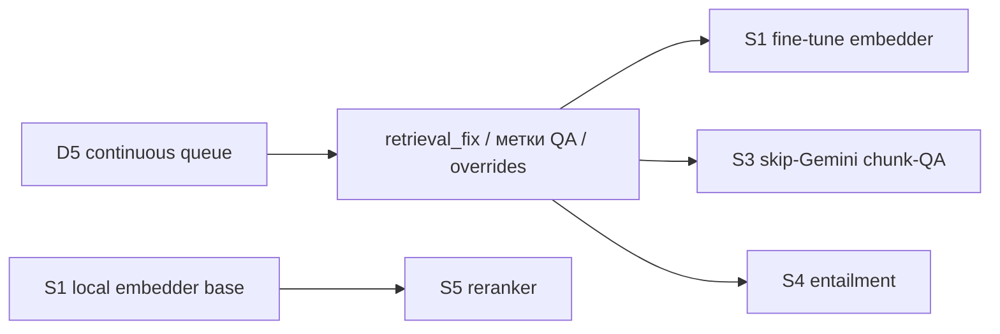

# План: тренированные модели для ускорения Protocol

**Проект:** Protocol
**Версия документа:** 1.0
**Дата:** июнь 2026
**Связанные документы:** [ml/README.md](../ml/README.md), [methodist-ml-priority-plan.md](./methodist-ml-priority-plan.md), [cursor-spend-checklist.md](./cursor-spend-checklist.md)

---

## 0. Идея и принцип

Цель - убрать главные источники латентности и стоимости: удалённые вызовы Gemini (embedding, ICD/routing/refine, L2-критерии, chunk-QA). Везде, где это безопасно, заменяем сетевой LLM-вызов на **локальную обученную модель** в контуре РБ.

**Не заменяем нейросетью** детерминированное ядро: `send_gate`, `compliance_gate`, правила 482+, ЦИСЗ. Принцип из `ml/README.md`.

Каркас уже есть в репозитории (`ml/train/*`, `ml/registry/model_manifest.json`), он описан под качество. Этот документ переосмысливает тот же слой под **скорость** и фиксирует порядок внедрения.

---

## 1. Где сегодня узкие места по скорости

| Источник | Где в пайплайне | Природа задержки |
|----------|-----------------|------------------|
| Embedding-вызовы Gemini | каждый retrieve + каждая офлайн-пересборка | сетевой round-trip на чанк (~1.1/с), упор в сеть и квоты |
| Gemini ICD-инференс / routing / refine | `/api/assist`, tier S2 | секунды и $ на запрос |
| Gemini L2-критерии / explainer | анализ КЗ, L2 | дорогой «хвост» при масштабе 1000 КЗ/день |
| Gemini chunk-QA | офлайн, Wave A / continuous queue (D5) | объёмные $ и время |

Эталонный пример боли: пересборка эмбеддингов (D2) идёт ~20 ч именно из-за per-chunk API round-trip.

---

## 2. Чек-лист внедрения (по приоритету скорость-ROI)

### S1 - Локальный embedder-бэкенд (наивысший ROI, работает уже сейчас)

- [ ] Включить `RAG_EMBED_BACKEND=local` на базовой локальной модели (fine-tune не требуется для выигрыша по скорости).
- [ ] Прописать активную модель в `ml/registry/model_manifest.json`.
- [ ] Gate: `python3 scripts/run_ab_embedder_kz.py` - consult_gold не хуже + golden RAG не хуже.
- [ ] Замерить латентность retrieve (онлайн) и время полной пересборки (офлайн).
- [ ] (Позже, для качества) fine-tune: `python3 ml/train/finetune_embedder.py --dataset ml/datasets/retrieval_pairs_resolved.jsonl`.

**Файлы:** `ml/train/finetune_embedder.py`, `ml/registry/model_manifest.json`, `scripts/run_ab_embedder_kz.py`
**Выигрыш:** онлайн retrieve - сетевой round-trip → десятки мс; офлайн-пересборка эмбеддингов (как D2) - **часы → минуты**, без зависимости от квот.
**Блокер скорости:** нет (база работает сразу). Fine-tune-качество упирается в ≥50 `retrieval_fix` (сейчас ~1).

### S2 - Классификатор query → ICD / рубрика / специальность

- [ ] Собрать датасет query→label из feedback + structured_index.
- [ ] Обучить (инфра `ml/train/train_chunk_classifier.py`, Hashing + OvR LogReg, обучение ~секунды).
- [ ] Включить как быстрый путь S1 / retrieve_only вместо Gemini ICD-инференса в `/api/assist`.
- [ ] Gate: `python3 scripts/run_symptom_icd_probe.py --local --no-gemini` - top-1 plausible не хуже baseline.

**Файлы:** `ml/train/train_chunk_classifier.py`, `scripts/run_symptom_icd_probe.py`
**Выигрыш:** секунды → <100 мс на маршрутизацию, без LLM в горячем пути.
**Блокер:** нет (дёшево обучить); нужен лишь датасет меток.

### S3 - Skip-Gemini классификатор chunk-QA

- [ ] Добрать метки chunk-QA (источник - continuous queue D5).
- [ ] Переобучить `chunk_classifier` и пройти P0 gate (F1 ≥ 0.85 по `preamble_leak`, чисто по `icd_inflation`).
- [ ] При прохождении gate включить skip-Gemini для чанков, помеченных «QA не нужен».

**Файлы:** `ml/train/train_chunk_classifier.py`, `ml/experiments/chunk_classifier_v1/REPORT.md`
**Выигрыш:** режет объём Gemini chunk-QA в Wave A / D5 (стоимость + время).
**Блокер:** сейчас gate FAIL (`preamble_leak` F1 0.63 < 0.85, `icd_inflation` мало примеров) - нужно больше данных.

### S4 - Локальный entailment matcher (критерии L2)

- [ ] Накопить ≥100 пар `entailment_pairs` (сейчас ~29) из `methodist_override` / overrides.
- [ ] Обучить `python3 ml/train/finetune_entailment.py`.
- [ ] Заменить LLM-проверки критериев в L2 на локальную NLI.

**Файлы:** `ml/train/finetune_entailment.py`
**Выигрыш:** ускоряет дорогие L2-эскалации (критично для 1000 КЗ/день).
**Блокер:** объём пар (~29 / 100).

### S5 - Локальный cross-encoder reranker

- [ ] После S1: обучить `python3 ml/train/finetune_reranker.py` на парах из retrieval-фидбэка.
- [ ] Включить локальный rerank вместо тяжёлого/удалённого.

**Файлы:** `ml/train/finetune_reranker.py`
**Выигрыш:** локальный батч-rerank вместо удалённого.
**Блокер:** данные из retrieval-фидбэка; делать после S1.

---

## 3. Зависимости и связка с планом D3-D5

- **S1 (база)** и **S2** можно внедрять сразу - они не упираются в данные.
- **S3 / S4 / fine-tune S1** заблокированы объёмом меток; их разблокирует **D5 (continuous queue)**, который как раз накапливает `retrieval_fix`, метки chunk-QA и overrides.
- То есть план D3 → D5 и этот ML-слой усиливают друг друга.

---

## 4. Пороги готовности (из methodist-ml-priority-plan §7)

| Метрика | Target | Влияет на |
|---------|--------|-----------|
| `retrieval_fix` (feedback) | 50 | fine-tune embedder (S1-качество), reranker (S5) |
| `entailment_pairs` | 100 | S4 |
| chunk-QA метки + P0 gate | F1 ≥ 0.85 | S3 |

**Правило:** локальный embedder-бэкенд по скорости (S1-база) и query-классификатор (S2) не ждут этих порогов - пороги нужны только для fine-tune-качества и для skip-Gemini.

---

## 5. Метрики успеха

| Метрика | Baseline | Цель |
|---------|----------|------|
| Латентность retrieve (онлайн embed) | сетевой round-trip | десятки мс |
| Время полной пересборки эмбеддингов | ~20 ч (API) | минуты (локально, батч) |
| Латентность маршрутизации (ICD/routing) | секунды (Gemini) | <100 мс (классификатор) |
| Доля чанков без Gemini-QA | 0% | растёт по мере прохождения S3 gate |
| Стоимость Gemini на прогон | baseline | снижение по S1/S2/S3 |

**Безопасность деплоя:** ни одна модель не включается в production, если её gate (A/B vs consult_gold, golden RAG, symptom-ICD probe, P0 chunk gate) хуже baseline.
